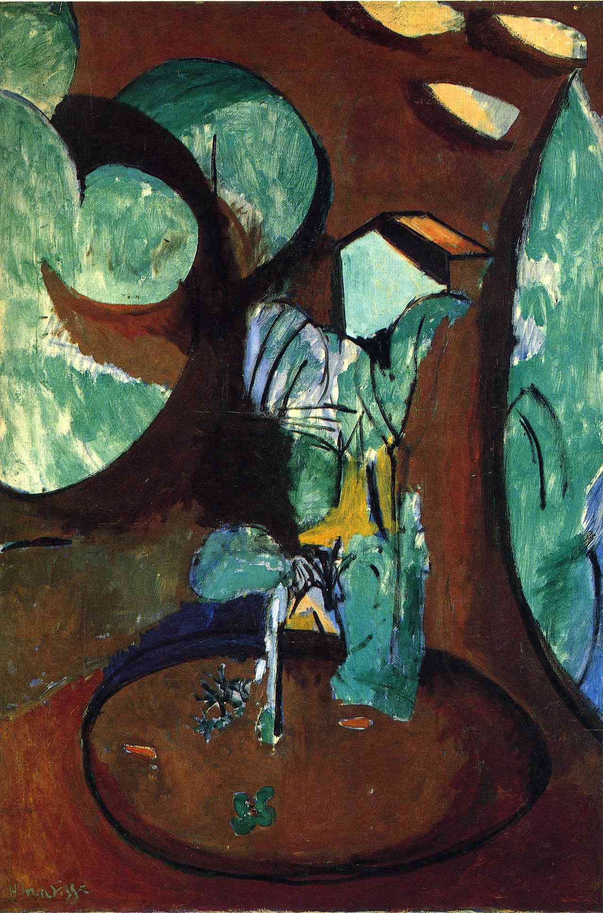

## 基本信息

- 作者：[[马蒂斯 Henri Matisse]]
- 创作年代：1917
- 材质：油画 (*not from wiki*)
- 尺寸：(*not from wiki*)
- 现存地：(*not from wiki*)

## 画面与技法

062 把此画安插在叙事节点："**一战爆发后，马蒂斯很奇怪地进入了一个 [[立体主义 Cubism]] 时期**"——作为该时期的样板作品出场。**具体原因留到讲毕加索时再说**。

(*not from wiki*) 画面呈现马蒂斯在巴黎南郊伊西-莱-穆利诺 (Issy-les-Moulineaux) 自家花园的视像——构图简化、色块层叠、有明显的立体主义切面化倾向。

## 历史背景 *(not from wiki)*

(*not from wiki*) 1917 一战末期马蒂斯创作。伊西-莱-穆利诺是马蒂斯 1909 起的住所与画室所在地——他在此度过了野兽派之后到 1917 立体主义时期最重要的几年创作期。

## 图片清单

| 编号 | 出自 | 描述 |
|---|---|---|
| 01 | [[062｜马蒂斯3：如何理解他一生的创作？]] | 花园景观 / 立体主义化构图 |

## 出现在

- [[062｜马蒂斯3：如何理解他一生的创作？]] —— 马蒂斯一战立体主义时期样板
