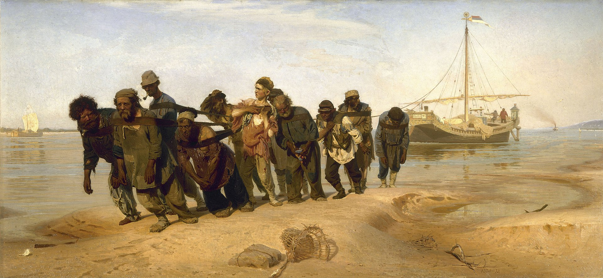

## 基本信息

- 作者：[[列宾 Ilya Repin]]
- 创作年代：1870–1873
- 材质：布面油画 (*not from wiki*)
- 尺寸：131.5 × 281 cm (*not from wiki*)
- 现存地：俄罗斯圣彼得堡国立俄罗斯博物馆 (*not from wiki*)

## 画面与技法

[[巡回画派 Peredvizhniki]] 在中国最广为人知的代表作之一。十一名身体被绳索勒得佝偻的纤夫拉着一艘搁浅的驳船在伏尔加河岸边艰难前行，画面色调暗沉，**现实主义**手法刻画底层劳动者的苦难——正是巡回画派"走向人民、走向外省"的典型主题。

## 历史背景 (*not from wiki*)

[[列宾 Ilya Repin]] 是 19 世纪后期俄罗斯现实主义绘画的旗手，本作奠定了他在俄罗斯艺术史中的地位。年轻的 [[马列维奇 Kazimir Malevich]] 在基辅艺术学校求学期间深受巡回画派影响。

## 图片清单

| 编号 | 出自 | 描述 |
|---|---|---|
| 01 | [[083｜马列维奇：什么是至上主义？]] | 全画 |

## 出现在

- [[083｜马列维奇：什么是至上主义？]]
