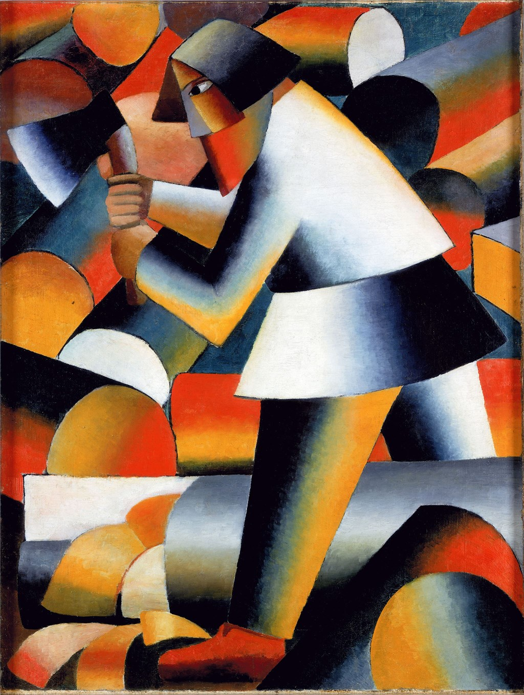

## 基本信息

- 作者：[[马列维奇 Kazimir Malevich]]
- 创作年代：1912
- 材质：布面油画 (*not from wiki*)
- 尺寸：年代不详 (*not from wiki*)
- 现存地：荷兰阿姆斯特丹市立博物馆 (*not from wiki*)

## 画面与技法

顾衡 083：本作是 [[马列维奇 Kazimir Malevich]] 1912 年进入 [[立体主义 Cubism]] 阶段的代表——**圆柱体**作为基本形状（与 [[莱热 Fernand Léger]] 的 [[管子主义 Tubism]] 不约而同），同时**浓浓的俄罗斯民俗元素被保留**：一个挥斧的伐木农夫被分解为发亮的圆柱与圆锥体块。

## 历史背景

马列维奇此前的"全盘西化"时期到此结束。受 1905 年日俄战争失败后斯托雷平改革推动的**俄罗斯民族主义思潮**影响，他开始在立体主义构图中加入俄罗斯本土风俗画元素。

## 图片清单

| 编号 | 出自 | 描述 |
|---|---|---|
| 01 | [[083｜马列维奇：什么是至上主义？]] | 全画 |

## 出现在

- [[083｜马列维奇：什么是至上主义？]]
