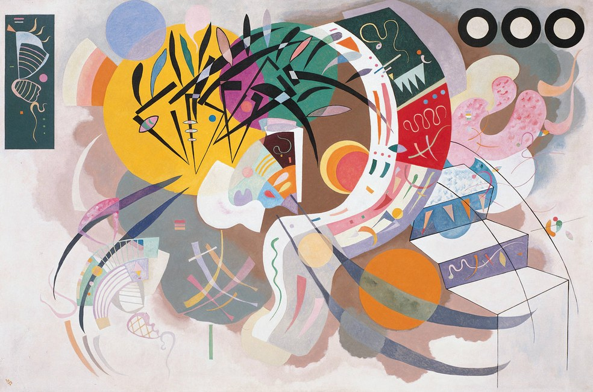

## 基本信息

- 作者：[[康定斯基 Wassily Kandinsky]]
- 创作年代：1936
- 材质：布面油画 (*not from wiki*)
- 尺寸：约 130 × 195 cm (*not from wiki*)
- 现存地：纽约古根海姆美术馆 (Solomon R. Guggenheim Museum, New York) (*not from wiki*)

## 画面与技法

康定斯基"巴黎晚期"代表作——1933 年纳粹关闭 [[包豪斯 Bauhaus]] 后，他迁居巴黎近郊 Neuilly-sur-Seine（直至 1944 年去世）(*not from wiki*)。本作可见他在几何元素之上叠加生物形态曲线，融合包豪斯严谨与超现实主义柔性形态。

顾衡 082 把它和 1925 年的《[[红色小梦 Small Dream in Red]]》并列，作为康定斯基**抽象成熟期**的样本。

## 图片清单

| 编号 | 出自 | 描述 |
|---|---|---|
| 01 | [[082｜康定斯基2：他为什么走向抽象？]] | 巴黎晚期抽象样本（1936） |

## 出现在

- [[082｜康定斯基2：他为什么走向抽象？]]
