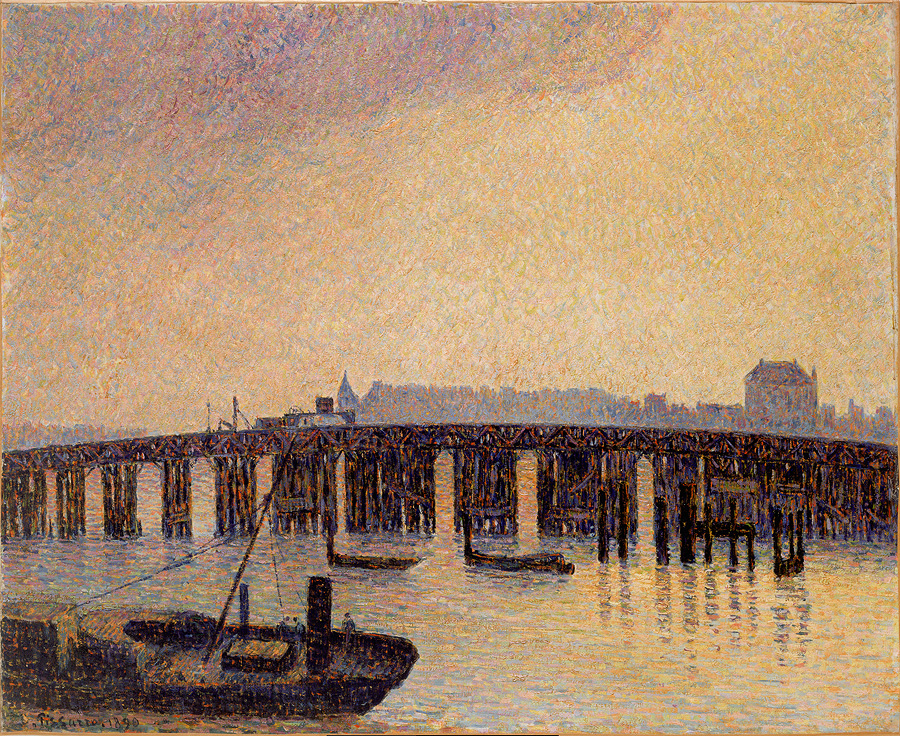

## 基本信息

- 作者：[[毕沙罗 Camille Pissarro]]
- 创作年代：1890 (*not from wiki*：毕沙罗在伦敦的作品多创作于 1870–71 普法战争避难期及 1890 年代多次访问期间，044 标注 1890)
- 材质：布面油画 (*not from wiki*)
- 尺寸：(*not from wiki*) 约 45 × 54 cm
- 现存地：(*not from wiki*) 私人收藏

## 画面与技法

[[毕沙罗 Camille Pissarro]] 在**英国**期间的代表作——伦敦泰晤士河上**老切尔西桥**（连接切尔西与巴特西，1858 年建成的早期铁桥；1934 年由现在的新切尔西桥取代）。雾气与桥的铁结构相互渗透——空气透视的精彩样本。

## 在课程中的角色

顾衡 044 用本作衔接 [[041｜莫奈1：颠覆式的创新从何而来？]] 末尾预告的**普法战争**——莫奈和毕沙罗一同避难英国。毕沙罗法国的家被普鲁士士兵改成屠宰场、**1500 幅画只剩 40 幅**——这是 044 中毕沙罗一生最戏剧性的损失节点。在英国期间，他不仅与莫奈共同经历这场流亡，也共同结识了画商 [[丢朗-吕厄 Paul Durand-Ruel]]——开启了日后印象派经纪人 / 画廊体系。

## 图片清单

| 编号 | 出自 | 描述 |
|---|---|---|
| 01 | [[044｜莫利索和毕沙罗：最纯正的印象派什么样？]] | 全画，雾中桥景 |

## 出现在

- [[044｜莫利索和毕沙罗：最纯正的印象派什么样？]] —— 普法战争避难英国时期作品
- [[毕沙罗 Camille Pissarro]] —— 代表作之一
