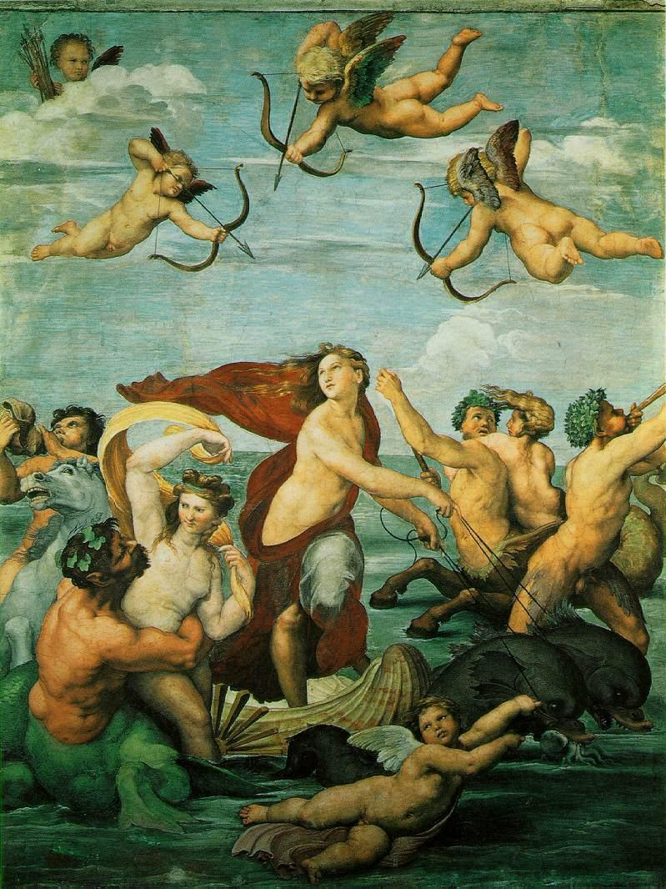

## 基本信息

- 作者：[[拉斐尔 Raphael]]
- 创作年代：1512–1514 (*not from wiki*)
- 材质：壁画 (fresco)
- 尺寸：295 × 224 cm (*not from wiki*)
- 现存地：罗马法尔内塞别墅 (Villa Farnesina, Roma) (*not from wiki*)

## 画面与技法

海洋仙女**伽拉蒂亚 (Galatea)** 站在一辆**两只海豚拉的贝壳战车**上，扭转身体回望——周围海仙、海怪、丘比特环绕——构成强烈的旋涡式构图。

顾衡 013："**从构图到人物造型，要说没从米开朗基罗那里有所借鉴，那我是不信的。**" 拉斐尔在伽拉蒂亚的身体扭转、肌肉感、动感表达上明显借鉴了米开朗基罗的人体处理。

## 历史背景

(*not from wiki*) 委托人是西耶纳银行家 Agostino Chigi (法尔内塞别墅的主人)，主题取自希腊神话——独眼巨人 Polyphemus 对仙女伽拉蒂亚的单恋——但拉斐尔画的不是悲剧瞬间，而是**伽拉蒂亚被海仙簇拥的胜利场面**。本作以**理想化美女形象**著称——拉斐尔后来在写给好友 Castiglione 的信中说："为了画一个美女，我得见许多美女……为了不足够时，我从我心中已经形成的某种'理念'中创作。" 这是 [[理念美 Idea of Beauty]] 的直接表述。

## 图片清单

| 编号 | 出自 | 描述 |
|---|---|---|
| 01 | [[013｜恩怨：文艺复兴三杰如何相互影响？]] | 整体图 |

## 出现在

- [[013｜恩怨：文艺复兴三杰如何相互影响？]]
