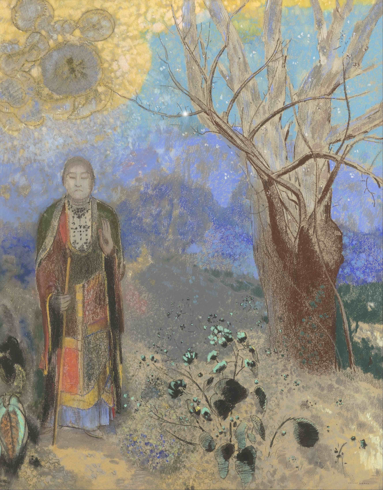

## 基本信息

- 作者：[[雷东 Odilon Redon]]
- 创作年代：1905
- 材质：粉彩（*not from wiki*：雷东中后期常用粉彩，色彩饱和）
- 尺寸：年代不详
- 现存地：奥赛博物馆（Musée d'Orsay, Paris）(*not from wiki*)

## 画面与技法

雷东由早期黑白转入鲜艳色彩阶段的代表作之一。坐姿佛陀置于盛开的花卉与树叶中——东方主题被纳入雷东的幻想视觉体系。

## 历史背景 (*not from wiki*)

19 世纪末至 20 世纪初法国绘画对东方 / 佛教题材的吸收（[[中国风 Chinoiserie]] 谱系的延伸），亦反映 [[象征主义 Symbolism]] 圈对"远东精神性"的浪漫化兴趣。

## 图片清单

| 编号 | 出自 | 描述 |
|---|---|---|
| 01 | [[051｜雷东：怪诞是不是象征主义的方向？]] | 坐姿佛陀置于花卉中 |

## 出现在

- [[051｜雷东：怪诞是不是象征主义的方向？]]
