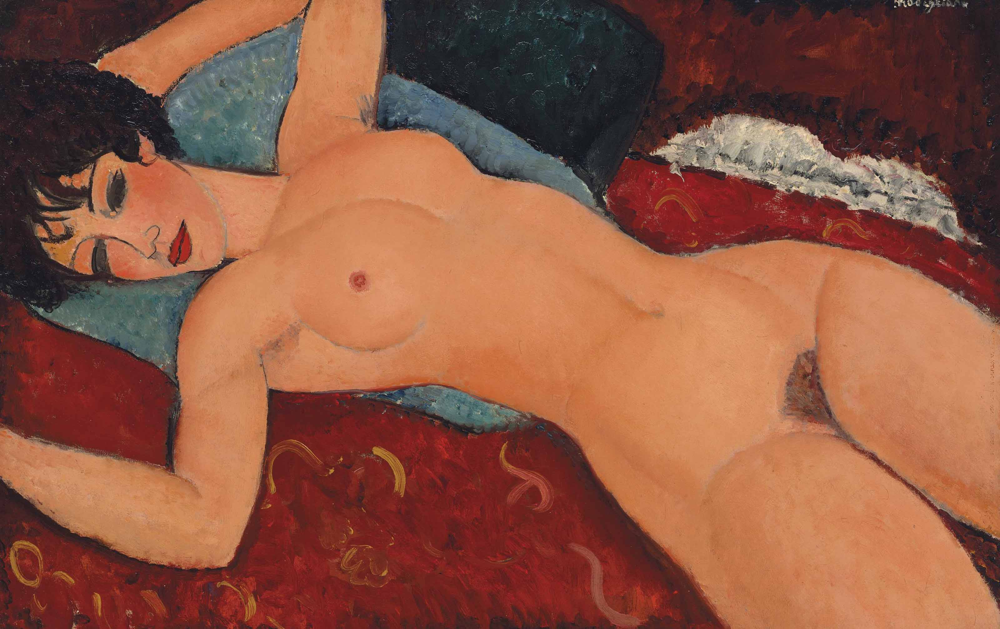

## 基本信息

- 作者：[[莫迪里阿尼 Amedeo Modigliani]]
- 创作年代：1917
- 材质：布面油画 (*not from wiki*)
- 尺寸：约 60 × 92 cm (*not from wiki*)
- 现存地：私人收藏（2015 年由刘益谦以 1.7 亿美元拍得） (*not from wiki*)

## 画面与技法

[[莫迪里阿尼 Amedeo Modigliani]] **最著名的裸体画之一**——红色背景、侧卧、眼神迷离。顾衡 078 关于本作的核心论断：

> 莫迪里阿尼的裸体画，是**没有个人特征**的，也就是说，它们是**高度程式化的**。莫迪里阿尼画的是"**女人**"，而不是"**某一个特定的女人**"。这也体现了从 [[布朗库西 Constantin Brâncuși]] 那里借鉴来的，对柏拉图 [[原型 (柏拉图) Archetype]] / [[理念美 Idea of Beauty]] 的追求。

**拍卖价**：2015 年 [[刘益谦 Liu Yiqian]] 以 **1.7 亿美元** 拍得（顾衡 078）。截至 2021 年，**占据绘画作品拍卖价第三名**——仅次于 [[救世主 (达·芬奇) Salvator Mundi]]（达·芬奇 4.5 亿美元）和 [[阿尔及尔女人 (毕加索) Women of Algiers (Picasso)]]（毕加索 1.79 亿美元）。

## 历史背景 (*not from wiki*)

1917 年莫迪里阿尼在巴黎 Berthe Weill 画廊举办了**生平唯一一次个展**，主打就是这一系列裸体画。**展览开幕当天即被警方因"淫秽"勒令撤展**——但此事反而让他声名远扬（顾衡 078）。

刘益谦 2015 年通过纽约佳士得购入，将作品送至他在上海的"龙美术馆"展出。

## 图片清单

| 编号 | 出自 | 描述 |
|---|---|---|
| 01 | [[078｜莫迪里阿尼：画中女子为什么让人一眼难忘？]] | 红底侧卧裸女 |

## 出现在

- [[078｜莫迪里阿尼：画中女子为什么让人一眼难忘？]]
