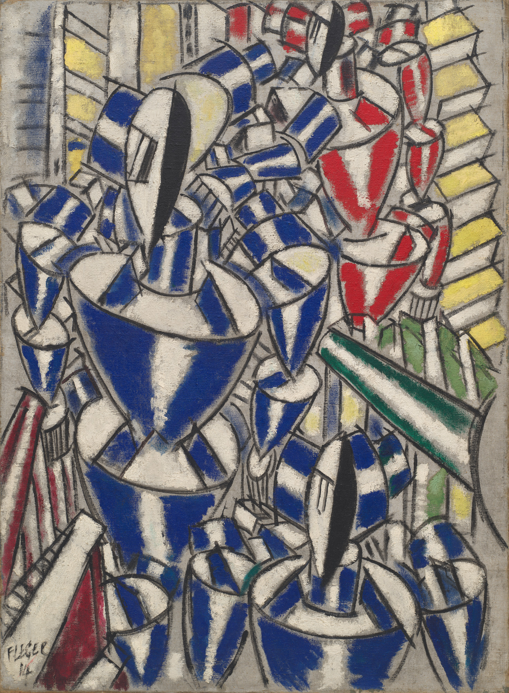

## 基本信息

- 作者：[[莱热 Fernand Léger]]
- 创作年代：1914
- 材质：布面油画 (*not from wiki*)
- 尺寸：约 134 × 96 cm (*not from wiki*)
- 现存地：纽约现代艺术博物馆 (MoMA) (*not from wiki*)

## 画面与技法

近乎**纯抽象**的画面：色块、圆柱、对角线交错——但莱热**仍然给它起了一个具象的名字**"俄国芭蕾舞团"。

顾衡用这件作品和《[[楼梯 (莱热) The Staircase|楼梯]]》对照："**他画了两幅看上去一模一样的画，但他丝毫不介意管其中的一幅叫《俄国芭蕾舞团》，而管另一幅叫《楼梯》。**"——这暴露莱热的根本立场：**只对艺术形式有兴趣，对表现真实世界毫无兴趣**。

## 历史背景 (*not from wiki*)

俄国芭蕾舞团 (Ballets Russes) 是 Diaghilev 1909 起在巴黎引发轰动的现代芭蕾团；马蒂斯、毕加索、夏加尔、莱热等都为其设计过舞台与服装。1914 年莱热入伍前已开始与该团接触。

## 图片清单

| 编号 | 出自 | 描述 |
|---|---|---|
| 01 | [[068｜立体主义，除了毕加索还值得了解什么？]] | 与《楼梯》几乎一模一样的"管子拼贴" |

## 出现在

- [[068｜立体主义，除了毕加索还值得了解什么？]] —— 与《楼梯》构成"标题任意性"的范例
