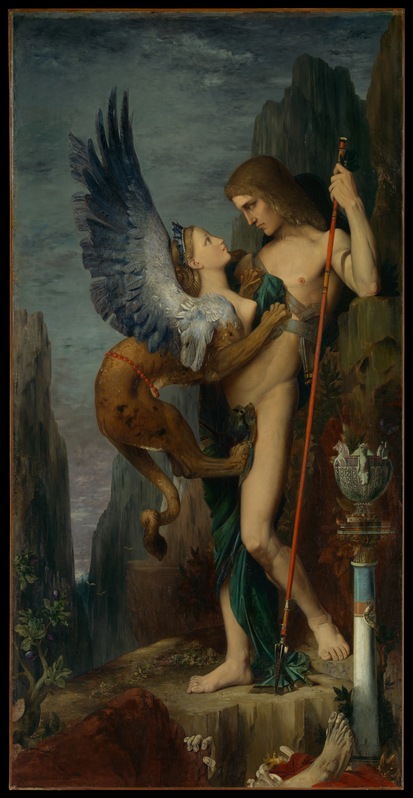

## 基本信息

- 作者：[[莫罗 Gustave Moreau]]
- 创作年代：1864
- 材质：油彩 / 画布 (*not from wiki*)
- 尺寸：206.4 × 104.8 cm (*not from wiki*)
- 现存地：(*not from wiki*) 美国大都会艺术博物馆 Metropolitan Museum of Art, New York

## 画面与技法

(*not from wiki*) 取材古希腊俄狄浦斯神话——青年俄狄浦斯与狮身人面像（Sphinx）四目相对、谜面在即的瞬间。莫罗以**神秘、装饰性、近乎学院派精修**的语言处理神话叙事——画面的细节与寓意密度都远超叙事所需，这种"叙事+寓意叠加"的处理方式正是顾衡 048 用它来开启**[[象征主义 Symbolism]]"朝向"问题**讨论的原因：象征主义画家并非把神话情节"翻译"出来，而是把抽象的观念**编码**到神话物象上、让画面成为意念附体的载体。

## 历史背景

(*not from wiki*) 1864 年沙龙首展轰动一时——此前莫罗以学院派画家身份起步，本作既保留学院派精修，又借神秘氛围与寓意层叠走向了**象征主义早期形态**。1864 年远早于 1886 年《[[象征主义宣言 Symbolist Manifesto]]》—— 这幅画因此被回顾性地认作**象征主义视觉先声**之一。

## 图片清单

| 编号 | 出自 | 描述 |
|---|---|---|
| 01 | [[048｜什么是象征主义？]] | 1864 全图，本课作为象征主义"朝向"问题的开场视觉示例 |

## 出现在

- [[048｜什么是象征主义？]]
