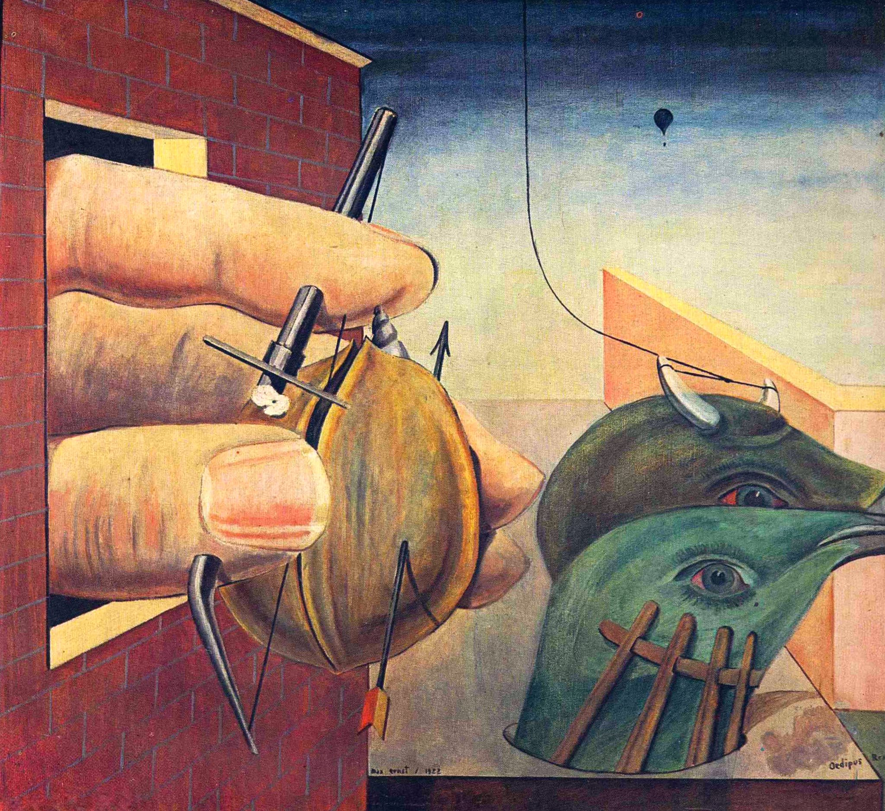

## 基本信息

- 作者：[[恩斯特 Max Ernst]]
- 创作年代：1922
- 材质：布面油画 (*not from wiki*)
- 现存地：私人收藏 (*not from wiki*)

## 画面与技法

恩斯特初到巴黎时期作品，标题取自索福克勒斯/弗洛伊德视域中的"俄狄浦斯"，但画面与神话剧情**无直接对应**——典型的"用 **诗意** 替代潜意识"路径：

- 几个互不关联的物象（手、坚果、鸟头、墙）并置
- 通过 [[洛特雷阿蒙 Comte de Lautréamont]] 式的错位搭配制造诗意

恩斯特反对对单个元素做精神分析式释义；标题本身也是错位搭配的一部分。

## 图片清单

| 编号 | 出自 | 描述 |
|---|---|---|
| 01 | [[093｜契里柯与恩斯特：如何用绘画表现超现实主义？]] | 一只穿过砖墙小窗的大手用钳子夹住核桃；窗外有鸟头与气球，背景天空辽阔 |

## 出现在

- [[093｜契里柯与恩斯特：如何用绘画表现超现实主义？]] — 恩斯特巴黎初期代表作
