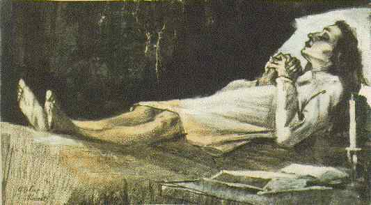

## 基本信息

- 作者：[[凡·高 Vincent van Gogh]]
- 创作年代：1883
- 材质：素描 (*not from wiki*)
- 尺寸：—
- 现存地：—
- 模特：[[西恩·霍尼克 Sien Hoornik]]

## 画面与技法

模特为同居伴侣 [[西恩·霍尼克 Sien Hoornik]]，姿态作"临终"装。057 中作为凡·高海牙时期—西恩同居期的代表作之一展示。

## 历史背景 (*not from wiki*)

凡·高在海牙时期对死亡、苦难母题的早期凝视。1883 年凡·高与西恩的同居走向破裂，凡·高 9 月离开海牙转赴 [[德伦特 Drenthe]] 与父母所在的纽南。

## 图片清单

| 编号 | 出自 | 描述 |
|---|---|---|
| 01 | [[057｜凡·高1：为什么说他"性格决定命运"？]] | 凡·高 1883 年《停尸床上的女人》，模特为西恩 |

## 出现在

- [[057｜凡·高1：为什么说他"性格决定命运"？]]
