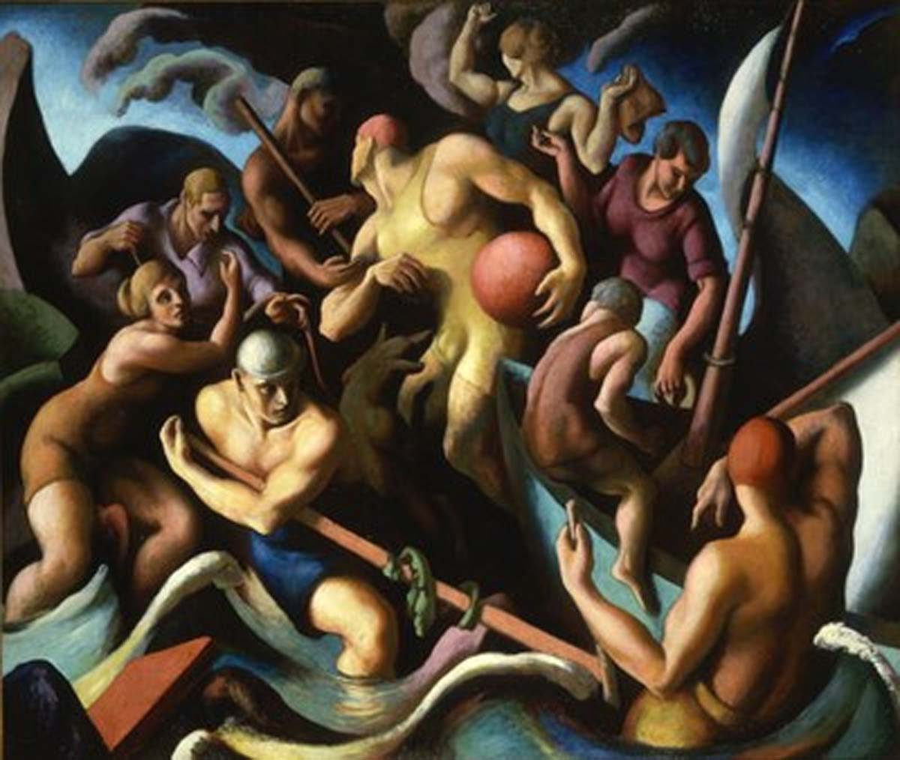

## 基本信息

- 作者：[[本顿 Thomas Hart Benton]]
- 创作年代：1920
- 材质：油画 (*not from wiki*)
- 尺寸：(*not from wiki*)
- 现存地：(*not from wiki*)

## 画面与技法

美国本土具象派早期作品，体现本顿的"区域主义"美学——粗壮人体、流动构图、底层人物题材。本课作为"波洛克的本顿师承"上下文出现。

## 历史背景 (*not from wiki*)

Chilmark 是马萨诸塞州马撒葡萄园岛的小镇，本顿 1920 年代常在此度夏并创作。

## 图片清单

| 编号 | 出自 | 描述 |
|---|---|---|
| 01 | [[096｜波洛克：什么是当代艺术的第一个流派？]] | 儿童 People of Chilmark (1920) |

## 出现在

- [[096｜波洛克：什么是当代艺术的第一个流派？]]
