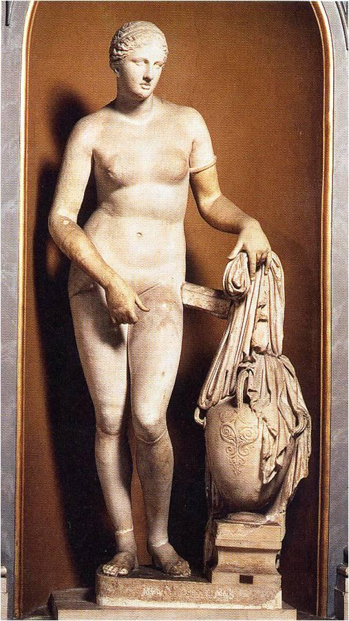

## 基本信息
- 作者：[[普拉克西特列斯 Praxiteles]]
- 创作年代：公元前 4 世纪
- 材质：大理石
- 现存地：原件已佚；多件罗马时期复制品（如 *Colonna Venus*）(*not from wiki*)

## 画面与技法
- 西方艺术史上第一件大型女性裸体雕像
- 女神左手拎衣，似要入浴；呈现 [[S 造型 Contrapposto]]
- 右手"遮挡私处" → 创立 [[用手遮挡私处母题 Venus pudica]]

## 历史背景 (*not from wiki*)
原作位于克尼多斯（小亚细亚西南沿岸）的阿弗洛狄忒神庙，是古代世界最著名的雕像之一。原件已佚，现以多件罗马复制品流传，最著名的是梵蒂冈博物馆藏的 *Colonna Venus*。

## 图片清单

| 编号 | 出自 | 描述 |
|---|---|---|
| 01 | [[002｜古希腊雕塑：为什么做得这么逼真？]] | 站姿全身复制品 |

<!-- src: https://piccdn3.umiwi.com/img/202103/10/202103101322386108099950.jpg -->

## 出现在
- [[002｜古希腊雕塑：为什么做得这么逼真？]]
