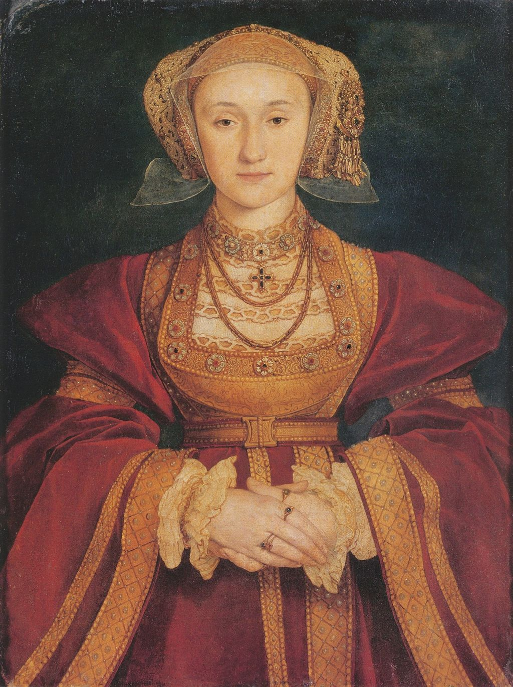

## 基本信息

- 作者：[[荷尔拜因 Hans Holbein the Younger]]
- 创作年代：1539 (顾衡引 "1539年")
- 材质：羊皮纸（vellum）+ 帆布 油彩 (*not from wiki*)
- 尺寸：约 65 × 48 cm (*not from wiki*)
- 现存地：Louvre, Paris (*not from wiki*)

## 画面与技法

[[亨利八世 Henry VIII of England]] 第四任王后 **克里维斯的安妮 Anne of Cleves** 正面半身像——华丽红金衣袍、繁复的金线刺绣、宝石头饰——典型佛兰德斯式细节描绘。

**意义**：本作是 16 世纪欧洲最有名的"政治后果灾难性"的肖像画——

> 哪里想到，克里维斯公爵这边啤酒香肠熏猪肘子管够造，**荷尔拜因的节操就去了爪哇国，把个安妮画得跟天仙似的**。

亨利八世一看画，"千喜欢万喜欢，立即就同意了这门亲事，一高兴还把女方的嫁妆给免了"。一见真人崩溃：

> 我后槽牙都咬碎了，也不行，我一点儿都不喜欢她。**她不好看，身上还有一股很难闻的味道**。

后果：这场婚姻成了压垮 [[克伦威尔 Thomas Cromwell]] 的最后一根稻草，克伦威尔走上断头台 (1540)。荷尔拜因本人却未受处罚——亨利八世对画家的容忍极为罕见。

## 历史背景

(*not from wiki*) 第三任王后 **简·西摩尔 Jane Seymour** 死于难产 (1537) 后，[[克伦威尔 Thomas Cromwell]] 极力主张亨利八世娶新教徒王后以巩固英国与神教联盟——选定德国 **克里维斯公爵 Duke of Cleves** 的姐姐安妮。亨利八世派 [[荷尔拜因 Hans Holbein the Younger]] 1539 赴德国画安妮的肖像供他定夺——本作即此次的"政治相亲画"。1540 年 1 月二人成婚，仅 6 个月后即宣布婚姻无效。

## 图片清单

| 编号 | 出自 | 描述 |
|---|---|---|
| 01 | [[021｜荷尔拜因：为什么要画那么多肖像画？]] | 整体图——"美化版"的相亲肖像 |

## 出现在

- [[021｜荷尔拜因：为什么要画那么多肖像画？]]
