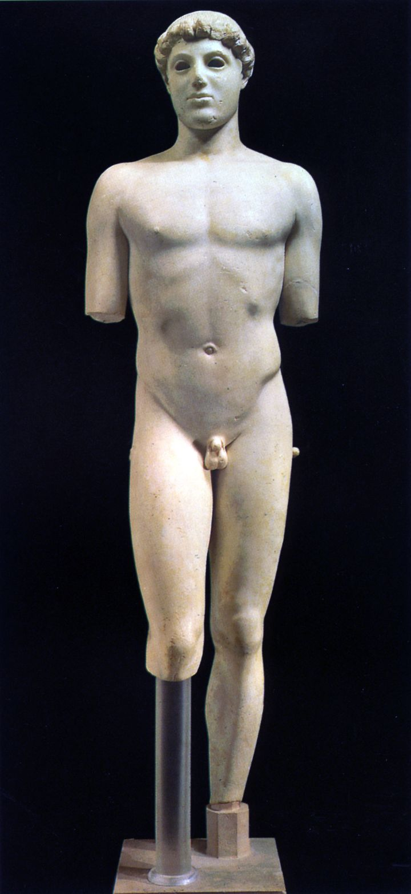

## 基本信息
- 作者：归于雕塑家 Kritios（推测）
- 创作年代：约公元前 480 年
- 材质：大理石
- 现存地：雅典卫城博物馆 (*not from wiki*)

## 画面与技法
- 与传统埃及式正面像相比，头部稍偏转
- **关键创新**：重心放到后腿（非平均分布于双脚），臀部相应发生变化
- 是从 [[埃及人体程式 (21 等份) Egyptian canon]] 走向 [[S 造型 Contrapposto]] 的过渡形态
- 标志着希腊雕塑从"按程式画 21 格"转向"对活人实地观察"的工作逻辑

## 历史背景 (*not from wiki*)
公元前 480 年波斯军攻陷雅典前后的作品，1865–1888 年间在雅典卫城出土。常被视为希腊雕塑跨入古典期的最早作品之一。

## 图片清单

| 编号 | 出自 | 描述 |
|---|---|---|
| 01 | [[002｜古希腊雕塑：为什么做得这么逼真？]] | 大理石全身像 |

<!-- src: https://piccdn3.umiwi.com/img/202103/10/202103101344037698506460.jpg -->

## 出现在
- [[002｜古希腊雕塑：为什么做得这么逼真？]]
