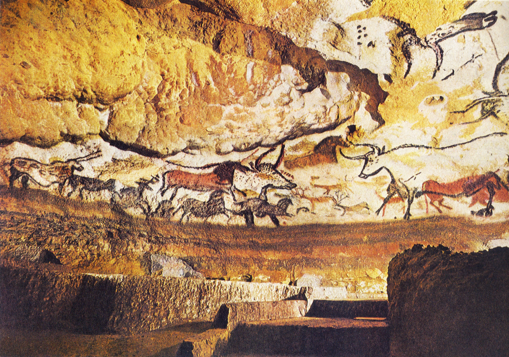

## 基本信息

- 作者：佚名（旧石器时代晚期克罗马农人）
- 创作年代：约公元前 28000 年—公元前 10000 年（顾衡 100 取"15000 年前"）
- 材质：天然矿物颜料（赭石、锰、木炭）岩壁壁画 (*not from wiki*)
- 尺寸：洞窟主厅长约 20 米 (*not from wiki*)
- 现存地：法国多尔多涅省 Lascaux 洞穴（原洞 1963 年关闭；公众可参观 Lascaux II/IV 复制品）(*not from wiki*)

## 画面与技法

主厅顶壁绘有大量野牛、马、鹿、羱羊形象，最大公牛长达 5 米。线条概括、动势精准，运用岩壁起伏制造立体感；颜料以矿物粉末混合脂肪/植物汁液涂抹或吹喷上岩。(*not from wiki*)

## 历史背景 *(not from wiki)*

1940 年 9 月由四名法国少年偶然发现。已知最古老的具象绘画群之一——比文字早约 1 万年。

顾衡 100 用此作反驳 [[老普林尼 Pliny the Elder]] 的"绘画始于科林斯陶匠之女"传说：在文字诞生之前，人类已经具备如此高超的造型技艺。其用途多被释为巫术 / 狩猎成功 / 部落仪式——参见 [[交感巫术 Sympathetic Magic]] (弗雷泽《[[金枝 The Golden Bough]]》解释模型)。

## 图片清单

| 编号 | 出自 | 描述 |
|---|---|---|
| 01 | [[100｜结语：为什么我们需要艺术？]] | 主厅顶壁——多头公牛与奔马 |

## 出现在

- [[100｜结语：为什么我们需要艺术？]]
