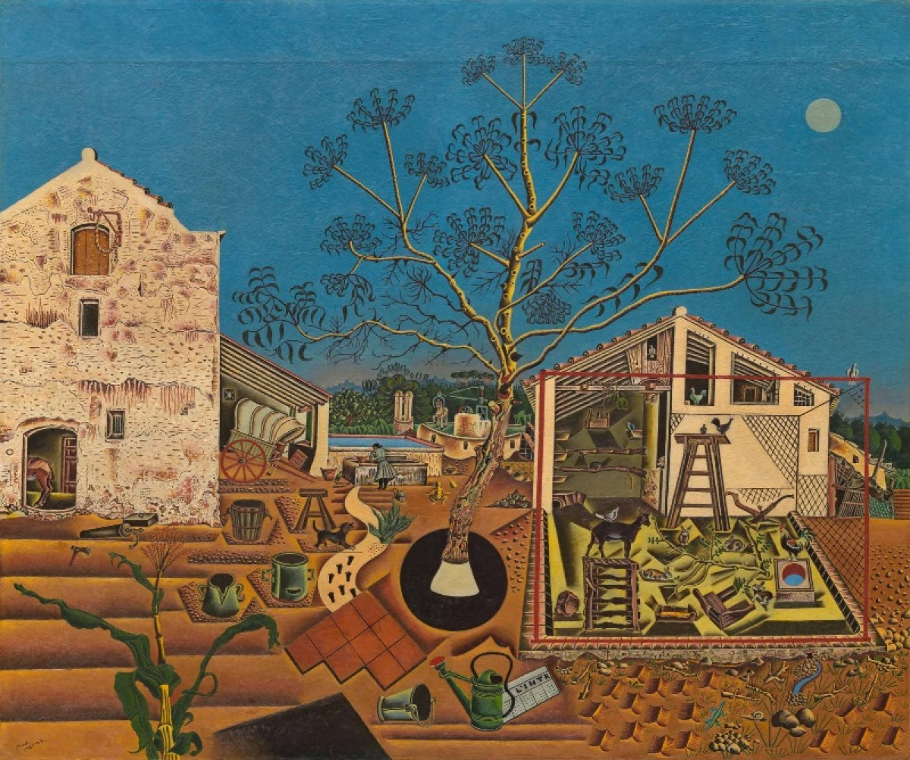

## 基本信息

- 作者：[[米罗 Joan Miró]]
- 创作年代：1921–1922
- 材质：布面油画 (*not from wiki*)
- 尺寸：123.8 × 141.3 cm (*not from wiki*)
- 现存地：华盛顿·美国国家美术馆（曾为海明威私藏）(*not from wiki*)

## 画面与技法

[[米罗 Joan Miró]] 1921–1922 年在巴黎完成的早期代表作。095 把它放在"美国人挖掘巴黎新锐艺术家"的脉络里——巴黎沙龙女主人 [[格特鲁德·斯坦因 Gertrude Stein]] 兄妹是把巴黎艺术家介绍到美国的重要桥梁，**[[海明威 Ernest Hemingway]] 就是在斯坦因家认识了米罗，用 500 美元买下了这幅《农庄》**。

(*not from wiki*) 画面以米罗童年蒙特罗伊格 (Mont-roig) 家族农场为题，把农场所有的具体物（树、动物、农具、井、屋顶等）以列表式细密排列。它处在米罗从写实向后来的符号化超现实主义过渡的关键节点——既保留了对实物的描绘准确度，又预示了 1923 年后画面"被大量小符号充斥"的装饰传统（与 [[杜菲 Raoul Dufy]] 的影响链一致；见 [[米罗 Joan Miró]] 条目）。

## 历史背景

(*not from wiki*) 米罗 1921 年第一次个展在巴黎被忽视后回西班牙苦干一年。这幅《农庄》在美术市场迟迟无人问津，1925 年才以低价卖给海明威——海明威后来把它视为自己最重要的藏品之一，"我宁可把它给任何人，也不愿把它卖掉"（海明威自述，*not from wiki*）。

## 图片清单

| 编号 | 出自 | 描述 |
|---|---|---|
| 01 | [[095｜什么是当代艺术？]] | 米罗《农庄》全图 |

## 出现在

- [[095｜什么是当代艺术？]]
