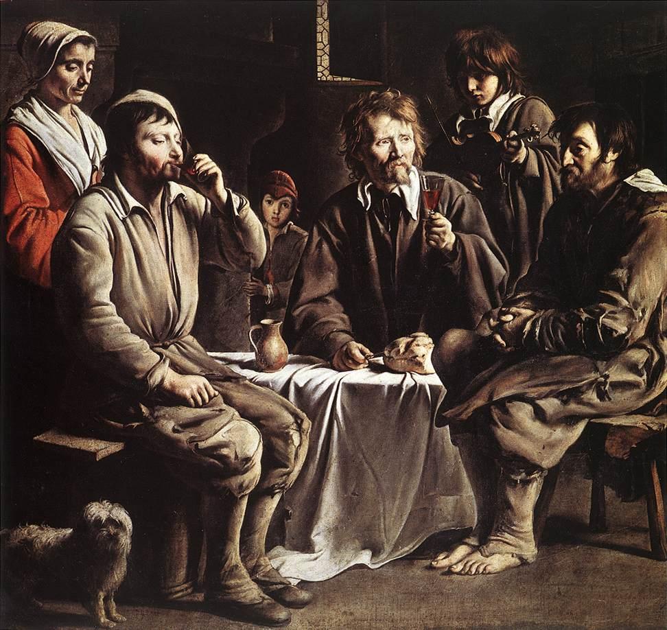

## 基本信息

- **作者**：[[路易·勒南 Louis Le Nain]]
- **创作年代**：1642
- **材质**：油画，布面 (*not from wiki*)
- **尺寸**：97 × 122 cm (*not from wiki*)
- **现存地**：法国巴黎卢浮宫 (*not from wiki*)

## 画面与技法

(*not from wiki*) 一间昏暗的农家屋内，几位农民围长桌而坐——**面容沉静、神情虔诚、目光不交流**——像是刚做完餐前祷告。**画面没有戏剧动作**——勃鲁盖尔式的热闹喧嚣"一扫而空"（顾衡 036），代之以**圣徒般的圣洁**。光线从左上斜射，明暗对比柔和——卡拉瓦乔派荷兰追随者的影响 + 弗朗德斯传统的混合。

## 历史背景 (*not from wiki*)

17 世纪上半叶**反宗教改革**（Counter-Reformation）背景下的产物——天主教依托耶稣会推动**基督徒日常生活的神圣化**："吃晚饭都要想到基督最后的晚餐"（顾衡 036）。在这种气氛下，勒南把农民画成**圣徒**。**路易·勒南**与兄弟 Antoine、Mathieu 三人合作（"勒南三兄弟"）——但本画一般归于路易。

## 在课程中的角色

顾衡 036 把本画作为**农民画 400 年传统的第二阶段**——从勃鲁盖尔的"太平象征"到勒南的"圣徒般的虔诚"。这是反宗教改革气氛在风俗画中的体现，**为后来卢梭的"高贵的野蛮人"和米勒的"道德监护人"做铺垫**。

## 图片清单

| 编号 | 出自 | 描述 |
|---|---|---|
| 01 | [[036｜米勒：什么是"伟大的现实主义"？]] | 全画 |

## 出现在

- [[036｜米勒：什么是"伟大的现实主义"？]] —— 农民画 400 年传统的第二阶段（反宗教改革语境）
- [[路易·勒南 Louis Le Nain]] —— 代表作
- [[特伦特大公会议 Council of Trent]] —— 反宗教改革文化背景
