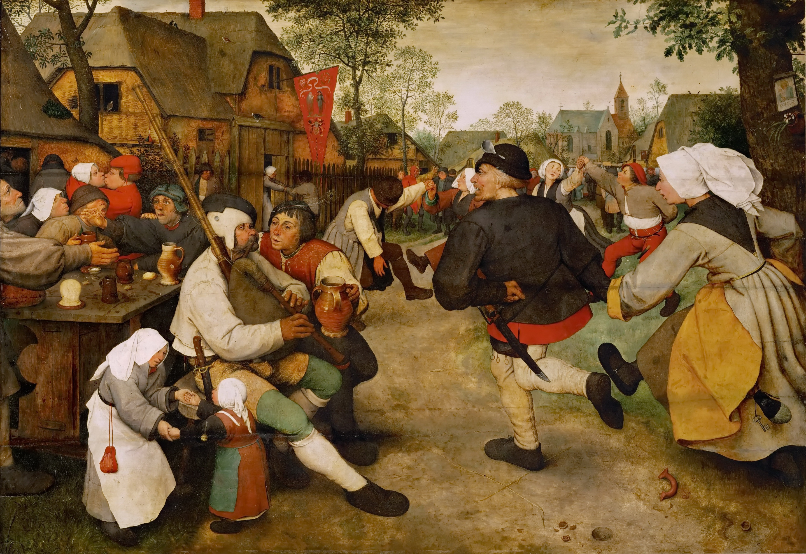

## 基本信息

- **作者**：[[勃鲁盖尔 Brueghel]]（老彼得·勃鲁盖尔 Pieter Bruegel the Elder）
- **创作年代**：约 1568
- **材质**：橡木板，蛋彩 / 油画 (*not from wiki*)
- **尺寸**：114 × 164 cm (*not from wiki*)
- **现存地**：奥地利维也纳艺术史博物馆（Kunsthistorisches Museum）(*not from wiki*)

## 画面与技法

(*not from wiki*) 鲁尔河畔小村酒馆门外：一对农民男女**正快步从画面右侧冲进画面**——男子大步流星拽着女子；旁边长椅上风笛手吹奏、酒桌前几对男女或饮酒或亲吻或争吵。**鲜艳的红黄色衣装**、**夸张的姿态**——勃鲁盖尔把农民画成了**生机勃勃的群像**。被后人称为"**表面现实主义 / 表演性的现实主义**"——勃鲁盖尔笔下农民"呆萌呆萌、快快乐乐"（顾衡 036），**画的是个象征：生活美满、天下太平**。

## 历史背景 (*not from wiki*)

老彼得·勃鲁盖尔是 16 世纪尼德兰最具影响力的画家之一——他把佛兰德斯画派从精致细密的宗教祭坛拉向**普通人的生活**。本画与《农民的婚礼》《婚礼舞会》构成他晚期农民系列的核心三联。两幅都于 1568 年完成、可能由同一委托人定制。

## 在课程中的角色

顾衡 036 把本画作为**农民画 400 年传统的起点**——证明早在 16 世纪农民就以主题入画，但**那时的农民是太平象征**（与 19 世纪米勒农民"动荡中的心灵寄托"形成历史链条的两端）。

## 图片清单

| 编号 | 出自 | 描述 |
|---|---|---|
| 01 | [[036｜米勒：什么是"伟大的现实主义"？]] | 全画 |

## 出现在

- [[036｜米勒：什么是"伟大的现实主义"？]] —— 农民画 400 年传统的起点
- [[勃鲁盖尔 Brueghel]] —— 代表作
- [[佛兰德斯画派 Flemish School]] —— 风俗画里程碑
