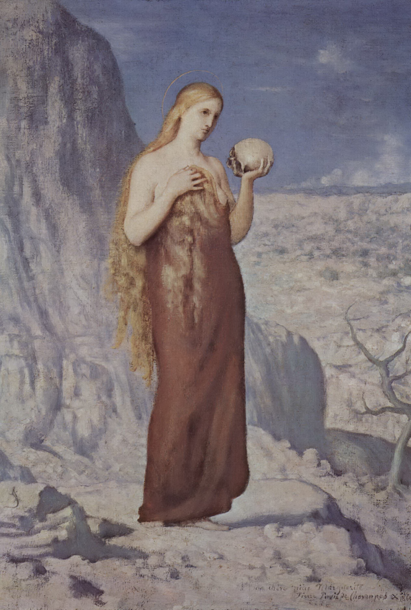

## 基本信息

- 作者：[[夏凡纳 Pierre Puvis de Chavannes]]
- 创作年代：1869
- 材质：油彩、画布 (*not from wiki*)
- 尺寸：(*not from wiki*)
- 现存地：(*not from wiki*) —— 私人收藏 / 多博物馆藏有版本

## 画面与技法

与 [[死亡与少女 (夏凡纳) Death and the Maidens]] 同属 [[夏凡纳 Pierre Puvis de Chavannes]] 的 **简化派范式**。**天空小、前景人物推向观众、用色含蓄、画面元素简单**，人物造型呈"寓意明确的海报感"——即使把人物拿出画面也能识别其含义。

顾衡在 [[049｜夏凡纳：如何制作象征主义的密电码？]] 中把它与《死亡与少女》并列，用来说明 **[[象征主义 Symbolism]] "密电码式造型"** 在静态题材中的体现。

## 历史背景 (*not from wiki*)

1869 是夏凡纳风格定型期的代表年——比《[[希望 (夏凡纳) Hope]]》(1872) 略早，表明其风格在普法战争前就已成熟。

## 图片清单

| 编号 | 出自 | 描述 |
|---|---|---|
| 01 | [[049｜夏凡纳：如何制作象征主义的密电码？]] | 整幅画面 |

## 出现在

- [[049｜夏凡纳：如何制作象征主义的密电码？]]
