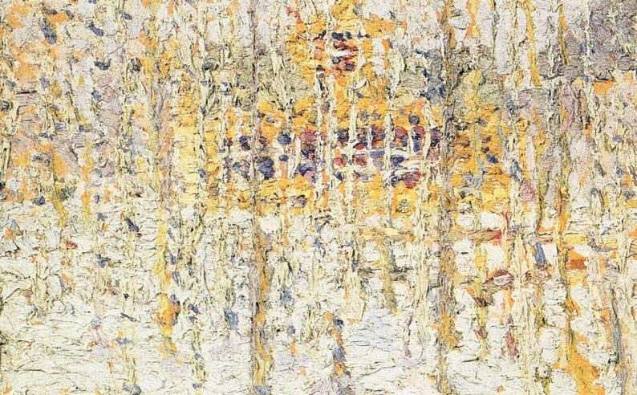

## 基本信息

- 作者：[[马列维奇 Kazimir Malevich]]
- 创作年代：1905（顾衡原文称《风景》并系年于此；caption 给出"冬季风景 Winter Landscape 1905"）
- 材质：布面油画 (*not from wiki*)
- 尺寸：年代不详 (*not from wiki*)
- 现存地：私人收藏 (*not from wiki*)

## 画面与技法

顾衡 083 称本作"是明显的新印象主义风格"——可见**分色小笔触**与点彩痕迹，是 [[马列维奇 Kazimir Malevich]] 全盘西化时期吸收 [[新印象主义 Neo-Impressionism]] 的样本。

## 图片清单

| 编号 | 出自 | 描述 |
|---|---|---|
| 01 | [[083｜马列维奇：什么是至上主义？]] | 全画 |

## 出现在

- [[083｜马列维奇：什么是至上主义？]]
