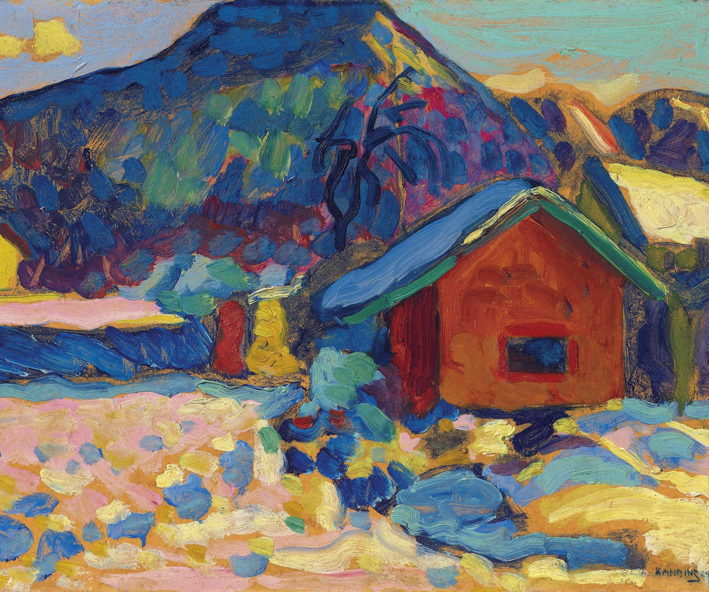

## 基本信息

- 作者：[[康定斯基 Wassily Kandinsky]]
- 创作年代：1910
- 材质：布面油画 (*not from wiki*)
- 尺寸：(*not from wiki*)
- 现存地：(*not from wiki*：圣彼得堡冬宫博物馆 The State Hermitage Museum)

## 画面与技法

色彩浓艳而主观，属于典型的 [[野兽派 Fauvism]] 风格，与同期 [[蓝山 Blue Mountain]] 并列。

## 历史背景 (*not from wiki*)

康定斯基从巴黎回到慕尼黑后、1911 年组建 [[青骑士 Der Blaue Reiter]] 前一年的作品。

## 图片清单

| 编号 | 出自 | 描述 |
|---|---|---|
| 01 | [[081｜康定斯基1：什么是抽象绘画？]] | 浓艳主观色彩的冬季山景 |

## 出现在

- [[081｜康定斯基1：什么是抽象绘画？]]
