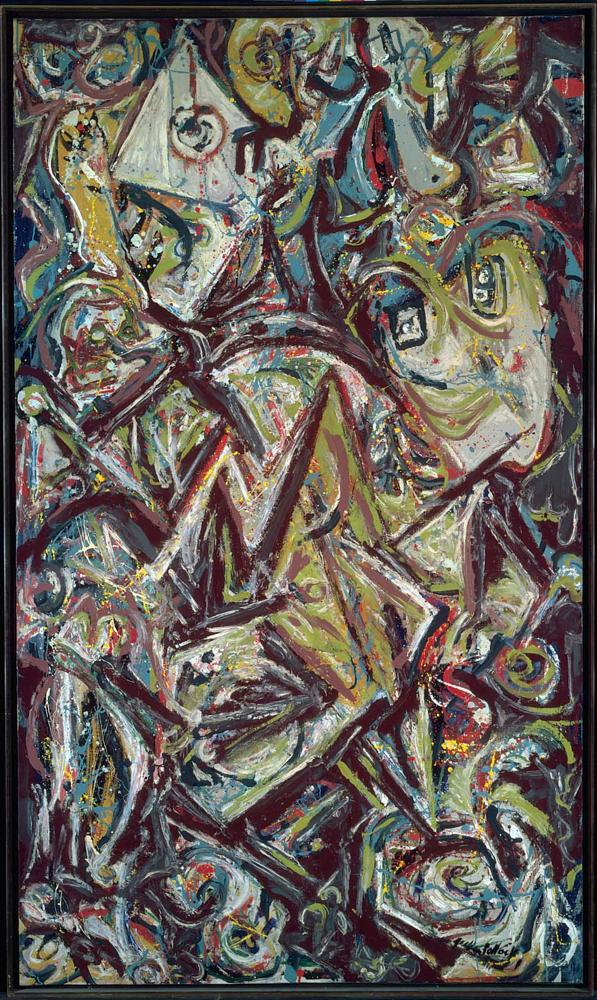

## 基本信息

- 作者：[[波洛克 Jackson Pollock]]
- 创作年代：1941
- 材质：(*not from wiki*)
- 尺寸：(*not from wiki*)
- 现存地：泰特美术馆 (*not from wiki*)

## 画面与技法

梦境绘画三联作之一（与《[[鸟 (波洛克) Bird (Pollock)]]》《[[面具 (波洛克) Mask (Pollock)]]》同期）。画面密集纠缠的形体反映 [[荣格 Carl Jung]] 原型理论的影响。

## 历史背景 (*not from wiki*)

1941 年纽约——超现实主义画家正大批从欧洲流亡到纽约，波洛克与他们接触并吸收自动书写美学。

## 图片清单

| 编号 | 出自 | 描述 |
|---|---|---|
| 01 | [[096｜波洛克：什么是当代艺术的第一个流派？]] | 出生 Birth (1941) |

## 出现在

- [[096｜波洛克：什么是当代艺术的第一个流派？]]
