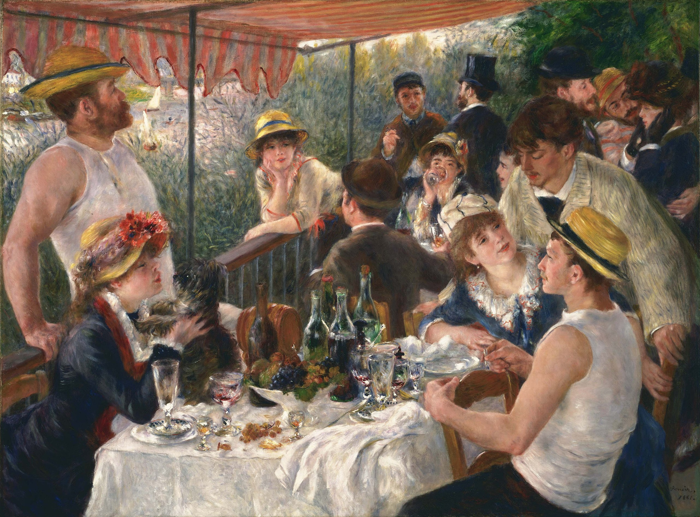

## 基本信息

- 作者：[[雷诺阿 Pierre-Auguste Renoir]]
- 创作年代：1880—1881
- 材质：布面油画 (*not from wiki*)
- 尺寸：130 × 173 cm (*not from wiki*)
- 现存地：菲利普收藏馆 The Phillips Collection, Washington D.C. (*not from wiki*)

## 画面与技法

043 顾衡定位为"雷诺阿这个阶段最成功也是最著名的作品"——继《[[达威尔小姐像 Portrait of Irène Cahen d'Anvers]]》之后再次在官方沙龙大获成功。

画面是塞纳河畔 Maison Fournaise 餐厅露台上的一场午餐：14 位人物中包含雷诺阿的朋友、画家同行 (画面右后侧戴帽划船工是雷诺阿好友卡耶博特 Gustave Caillebotte)、未来妻子艾琳·夏里戈 Aline Charigot（前景与小狗玩耍）、女演员 Ellen Andrée 等——是雷诺阿"折衷公式"的最辉煌实践：

- **人物**：清晰可读的肖像式处理；
- **环境与光线**：印象派碎笔触；
- **构图**：金字塔、三角组合等学院派经典构图。

这件作品的成功也是 043 全篇论证"妥协造就大师"的标志性产物。同年雷诺阿前往**意大利游历**，在罗马见到 [[拉斐尔 Raphael]] 真迹后做出"我的印象派已经走到了尽头"的著名公开声明，宣告自己是"安格尔主义者"。

## 历史背景 (*not from wiki*)

1881 年沙龙展出获巨大反响。本作创作前后 1880–1881 年间雷诺阿正与艾琳·夏里戈热恋（她坐画面左下角与小狗玩，后成为雷诺阿妻子、雷诺阿三子—包括著名电影导演让·雷诺阿—之母）。

## 图片清单

| 编号 | 出自 | 描述 |
|---|---|---|
| 01 | [[043｜雷诺阿：妥协如何造就大师？]] | 全图，餐厅露台午餐场景 |

## 出现在

- [[043｜雷诺阿：妥协如何造就大师？]]
