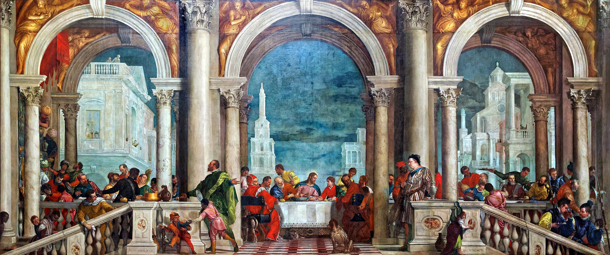

## 基本信息

- 作者：[[委罗内塞 Paolo Veronese]]
- 创作年代：1573
- 材质：布面油画 (*not from wiki*)
- 尺寸：555 × 1310 cm (*not from wiki*)
- 现存地：威尼斯学院美术馆 Gallerie dell'Accademia, Venezia (*not from wiki*)

## 画面与技法

巨幅水平横宽画，三连拱白色古典柱廊为背景，长桌占满整个中下景。基督居中，门徒分立两侧；但画面充斥**与圣经叙事毫不相干的角色**——小丑、侏儒、狗、黑奴侍者、醉汉、佩武器的德意志雇佣兵、华服商人、楼梯上嬉戏的童仆。气氛从"基督说出'你们之中有一人要出卖我'后的肃穆"变成**威尼斯式贵族宴会**。(*not from wiki*)

## 历史背景

(*not from wiki*) 委罗内塞原本为多明我会圣若望与圣保罗教堂修道院食堂所绘，**原标题就是《最后的晚餐》(L'Ultima Cena)**，意在替换火灾损毁的提香前作。1573 年 7 月 18 日，威尼斯宗教裁判所传讯委罗内塞，质问他为什么在基督最神圣的一顿饭里塞进小丑、侏儒、酗酒的德意志雇佣兵这些"反宗教改革"时期天主教竭力要肃清的"不庄重元素"——审讯记录至今保存，是文艺复兴艺术家与宗教审查直接对话的少见文献。

委罗内塞的应对极为机智：他**不修改画面**，只把**画名从《最后的晚餐》改为《利未家的晚餐》**（路加福音 5:29，税吏利未为耶稣办的宴席，新约里确实是基督在富人家与"罪人和税吏"同席）——一个改名就让宗教裁判所失去把柄。

顾衡 031 用此事作为"**意大利各城市画家有自己的行会，教皇 / 宗教裁判所只能用钱表态，不能强制定义谁是不是画家**"的代表案例——对照路易十四把法国画家纳入官办学院体制后"得不到学院认可就不算画家"的霸道。

## 图片清单

| 编号 | 出自 | 描述 |
|---|---|---|
| 01 | [[031｜学院派为什么迅速没落？]] | 整体图；威尼斯学院美术馆藏 |

## 出现在

- [[031｜学院派为什么迅速没落？]]
