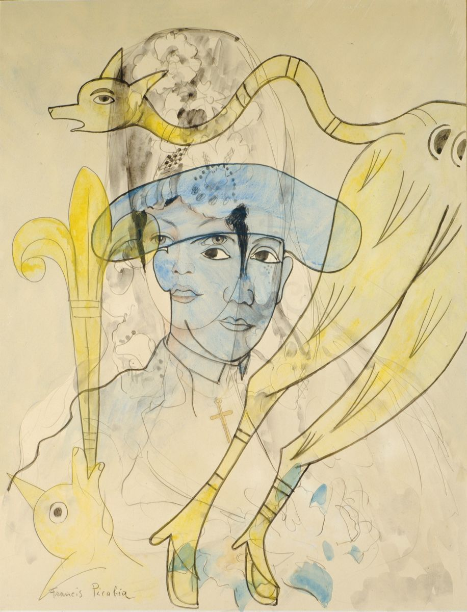

## 基本信息

- 作者：[[毕卡比亚 Francis Picabia]]
- 创作年代：1927–1928
- 材质：布面油画 (*not from wiki*)
- 尺寸：年代不详 (*not from wiki*)
- 现存地：私人收藏 (*not from wiki*)

## 画面与技法

[[毕卡比亚 Francis Picabia]] **[[毕卡比亚画派 Picabia School]] 透明画期**代表作——多重图像层叠透写于同一画面，是毕卡比亚不接受 [[超现实主义 Surrealism]] 接管达达骨干后**自创的对抗性画派**。

## 历史背景

(*not from wiki*) 1924 年 [[超现实主义 Surrealism]] 宣言发表，达达大部分骨干转投布勒东 (*not from wiki*) 麾下；毕卡比亚不甘心，独立开辟透明画路线。

## 图片清单

| 编号 | 出自 | 描述 |
|---|---|---|
| 01 | [[091｜毕卡比亚：如何用绘画表现达达主义？]] | 整体图 — 透明叠画 |

## 出现在

- [[091｜毕卡比亚：如何用绘画表现达达主义？]]
