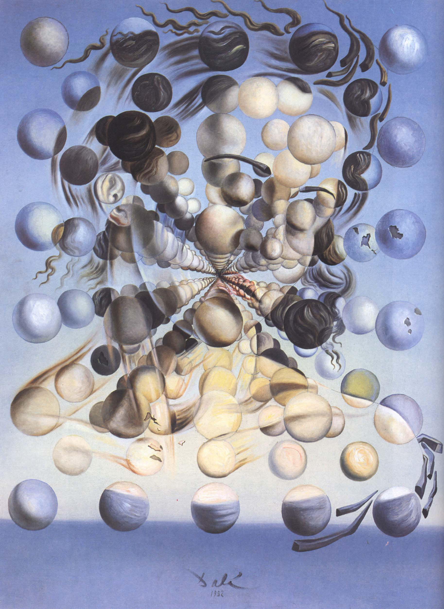

## 基本信息

- 作者：[[达利 Salvador Dalí]]
- 创作年代：1952
- 材质：布面油画 (*not from wiki*)
- 尺寸：(*not from wiki*) 65 × 54 cm
- 现存地：(*not from wiki*) 西班牙菲格拉斯达利剧院博物馆（Teatro-Museo Dalí, Figueres）

## 画面与技法

094 中与《[[拉斐尔风格爆炸头 (达利) Raphaelesque Head Exploding]]》并列，作为达利**蹭核物理流量**期代表出场。

(*not from wiki*) 画的是 [[加拉 Gala Dalí]] 的肖像——但她的面孔由无数悬浮的彩色球体构成。每个球体本身又是一个微观的彩绘单元——形似原子云、又像基本粒子的概率分布——把加拉**升格为原子时代的女神 Galatea**（题名一语双关：希腊神话中皮格马利翁的雕像情人/达利的妻子加拉/原子球体）。

## 历史背景 (*not from wiki*)

属于达利**核神秘主义**（Nuclear Mysticism）时期。1952 年达利在《神秘主义宣言》中宣告："经过二十年的精神分析探索，我现在又回到了古典与神秘——但这次有量子力学撑腰。"

## 图片清单

| 编号 | 出自 | 描述 |
|---|---|---|
| 01 | [[094｜达利：为什么他画的是"伪装的梦"？]] | 全图 |

## 出现在

- [[094｜达利：为什么他画的是"伪装的梦"？]]
