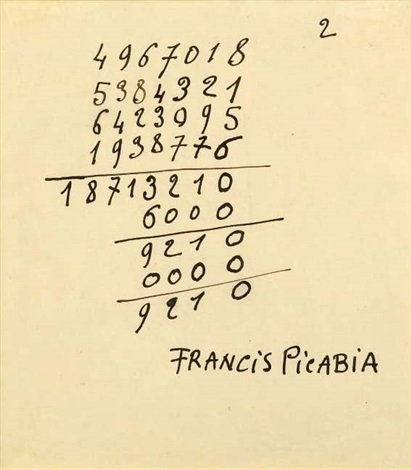

## 基本信息

- 作者：[[毕卡比亚 Francis Picabia]]
- 创作年代：1920
- 材质：布面油画 (*not from wiki*)
- 尺寸：年代不详 (*not from wiki*)
- 现存地：私人收藏 (*not from wiki*)

## 画面与技法

[[毕卡比亚 Francis Picabia]] **达达无厘头期**作品——直接把一道**加法算式**画到画布上当作"绘画"。"无厘头"到极致：连数学题都成了画。

顾衡的注脚："我算了一下，竟然是对的！"——这恰恰是达达精神的核心：当艺术放弃所有规则、把算式当画，**算式本身做对做错都不再重要**——但它居然是对的，又构成一层戏拟。

## 历史背景

(*not from wiki*) 1920 年正是 [[杜尚 Marcel Duchamp]] 一年前 (1919) 完成的 *L.H.O.O.Q.* (蒙娜丽莎加胡子)——毕卡比亚的《加法》是这种"绘画无厘头化"思路的延续。

## 图片清单

| 编号 | 出自 | 描述 |
|---|---|---|
| 01 | [[091｜毕卡比亚：如何用绘画表现达达主义？]] | 整体图 — 加法算式 = 绘画 |

## 出现在

- [[091｜毕卡比亚：如何用绘画表现达达主义？]]
