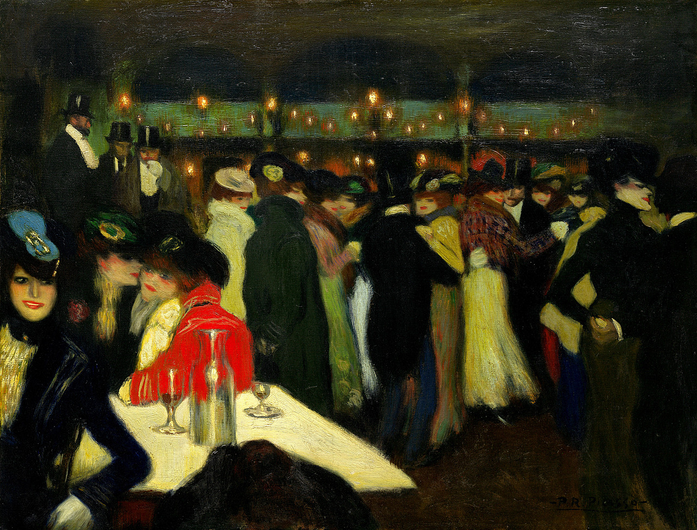

## 基本信息

- 作者：[[毕加索 Pablo Picasso]]
- 创作年代：1900
- 材质：布面油画 (*not from wiki*)
- 尺寸：88.2 × 115.5 cm (*not from wiki*)
- 现存地：纽约古根海姆博物馆 (*not from wiki*)

## 画面与技法

毕加索初到巴黎后的第一批夜场题材作品之一——蒙马特著名舞厅 Moulin de la Galette 的夜景。本讲（064）将其作为 **学 [[马奈 Édouard Manet]]** 的样本：构图与人物动势直接承袭马奈的咖啡馆-舞厅类型画。色调偏冷、光线戏剧化，预示了即将到来的 [[蓝色时期 Blue Period]]。

> 注：同名题材 Renoir 有 1876 年名作《煎饼磨坊的舞会》(*Bal du moulin de la Galette*)、劳特累克亦多有处理；本作为 **毕加索版本**，与雷诺阿、劳特累克版本不可混淆。 (*not from wiki*)

## 历史背景 (*not from wiki*)

- 创作于毕加索抵达巴黎后不久——巴黎博览会年（1900）。
- 标志着毕加索蒙马特"花花世界"题材的开端。

## 图片清单

| 编号 | 出自 | 描述 |
|---|---|---|
| 01 | [[064｜毕加索1：如何理解"蓝色时期"和"玫瑰红时期"？]] | 整幅画面 |

## 出现在

- [[064｜毕加索1：如何理解"蓝色时期"和"玫瑰红时期"？]]
