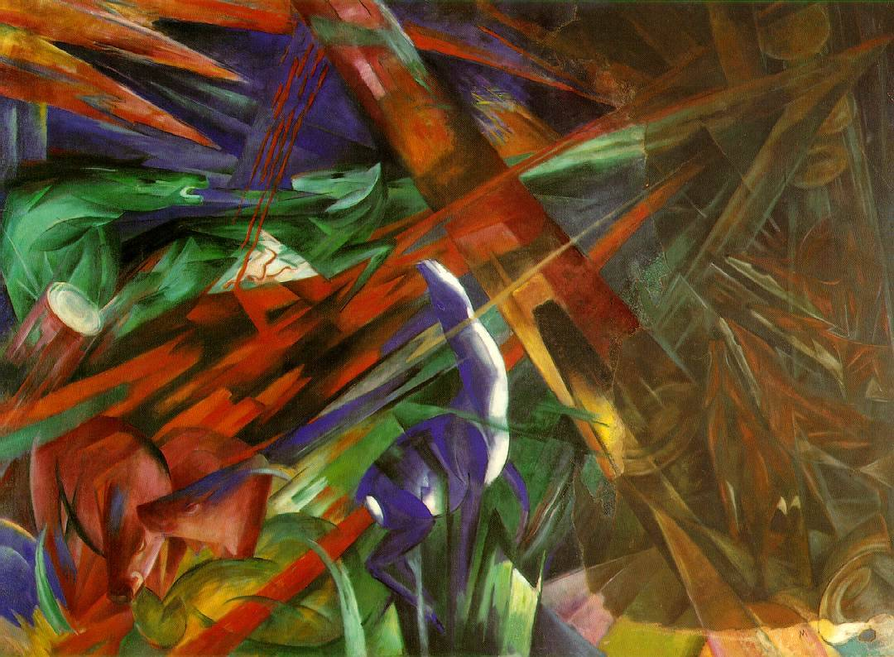

## 基本信息

- 作者：[[马尔克 Franz Marc]]
- 创作年代：1913
- 材质：布面油画 (*not from wiki*)
- 尺寸：194.3 × 263.5 cm (*not from wiki*)
- 现存地：巴塞尔市立美术馆 (Kunstmuseum Basel) (*not from wiki*)

## 画面与技法

[[马尔克 Franz Marc]] 1913 年完成的大型油画——红蓝绿黄色块在画面上撕扯纠缠，动物的轮廓（鹿、马、野猪）被几何化、几乎要被抽象的形势吞没。095 把它与同年的《[[战争中的形 Fighting Forms]]》并列举出：从画面内容看，**就是"又抽象又表现"**——给后来 [[赫伯特·里德 Herbert Read]] "抽象表现主义是康定斯基血脉"的判断提供了视觉证据。

(*not from wiki*) 马尔克自己在画背后题字："Und alles Sein ist flammend Leid"（一切存在都是燃烧着的痛苦）。一战爆发后他写给妻子的信里说："看到这幅画就像是一种预言，让人毛骨悚然"。1916 年马尔克阵亡于凡尔登战役。

## 历史背景

(*not from wiki*) 是马尔克晚期最重要的作品之一，连同《战争中的形》一起被视为 [[青骑士 Der Blaue Reiter]] 慕尼黑核心向纯抽象推进的代表。一战中曾在仓库失火受损，由马尔克好友 [[克利 Paul Klee]] 修复。

## 图片清单

| 编号 | 出自 | 描述 |
|---|---|---|
| 01 | [[095｜什么是当代艺术？]] | 红绿蓝色块中几何化动物轮廓的撕扯 |

## 出现在

- [[095｜什么是当代艺术？]]
