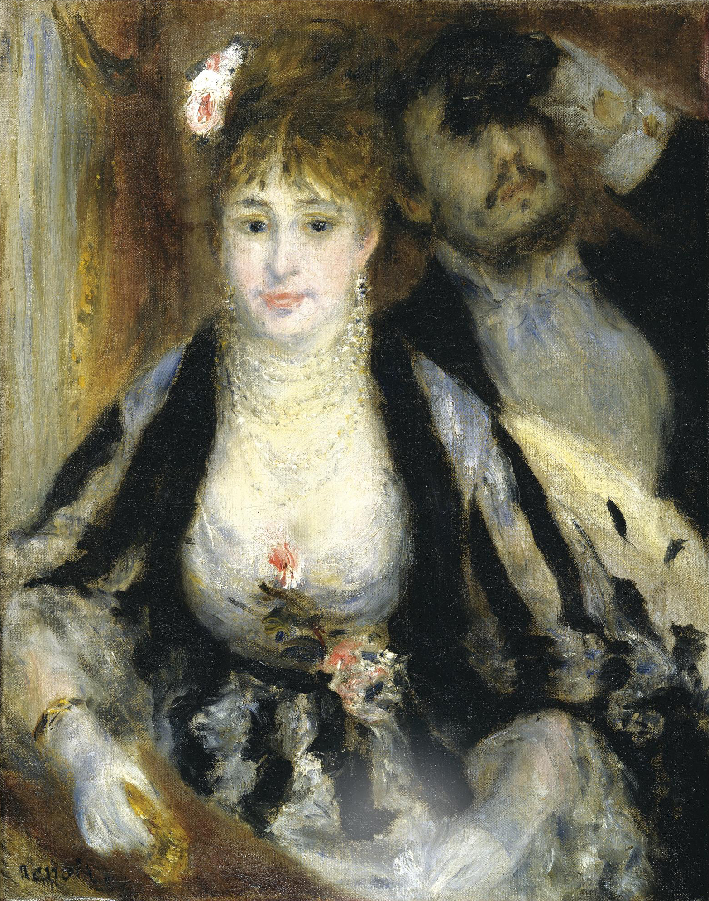

## 基本信息

- 作者：[[雷诺阿 Pierre-Auguste Renoir]]
- 创作年代：1874
- 材质：布面油画 (*not from wiki*)
- 尺寸：80 × 63.5 cm (*not from wiki*)
- 现存地：考陶尔德艺术学院画廊 Courtauld Gallery, London (*not from wiki*)

## 画面与技法

043 顾衡列为"雷诺阿妥协人格的最佳标本"。雷诺阿特意为 1874 年第一届印象派画展选送此作，三处妥协痕迹由顾衡逐条列出：

1. **室内完成**——而不是坚守印象派"户外、外光下作画"原则；
2. **人物面部传统画法**——不用小笔触，只在处理衣服时才用细碎笔触；
3. **使用黑色**——印象派禁忌之一是不用黑色（户外阴影认为缺光不缺色，故用深绿/深紫），但本作既是室内作品就解禁了。

正因这三重妥协，《包厢》在第一届印象派画展中**侥幸逃过毒舌、当场以 425 法郎卖出**——在朋友们普遍滞销的情况下，这成了雷诺阿"圆融变通就能活下去"的最早成功案例。

## 历史背景 (*not from wiki*)

1874 年 4 月第一届印象派画展（在纳达尔工作室）整体惨败，唯独《包厢》既未遭恶评又卖出，成为画展少数亮色。模特说法不一，一般认为女主角是模特尼妮 (Nini Lopez)，男主是雷诺阿弟弟埃德蒙 Edmond Renoir。

## 图片清单

| 编号 | 出自 | 描述 |
|---|---|---|
| 01 | [[043｜雷诺阿：妥协如何造就大师？]] | 全图，剧院包厢里的男女 |

## 出现在

- [[043｜雷诺阿：妥协如何造就大师？]]
