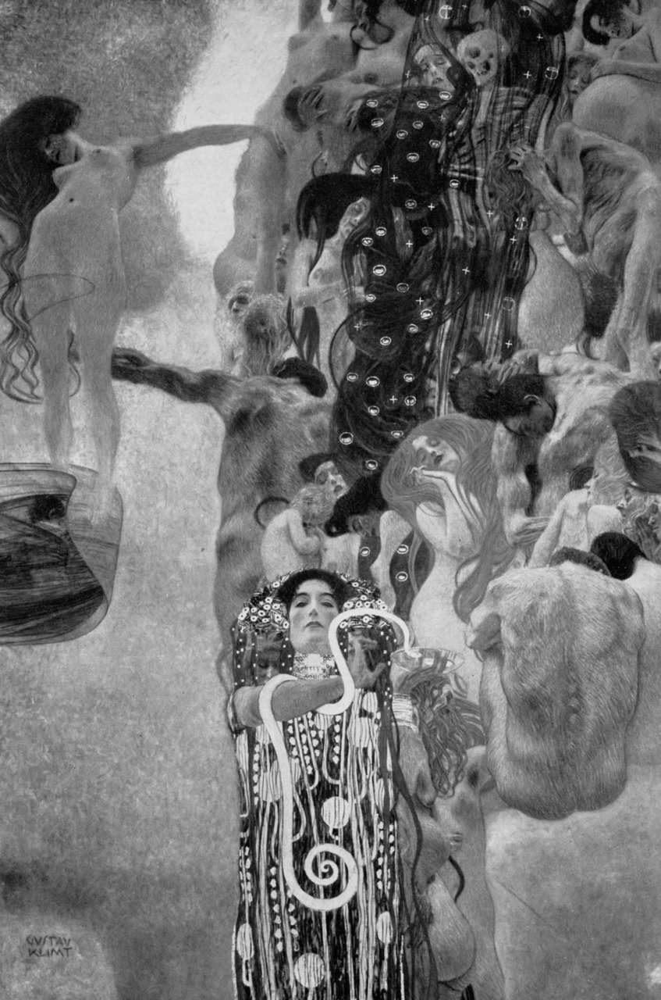

## 基本信息

- 作者：[[克里姆特 Gustav Klimt]]
- 创作年代：1899–1907
- 材质：（*not from wiki*）天顶壁画 / 布面油画（原计划装入维也纳大学礼堂天顶）
- 尺寸：（*not from wiki*）430 × 300 cm
- 现存地：**1945 年毁于纳粹炮火**（顾衡 073）

## 画面与技法

克里姆特受委托为维也纳大学礼堂天顶绘制 [[哲学 Philosophy (克里姆特)]] / [[医学 Medicine (克里姆特)]] / [[法学 Jurisprudence (克里姆特)]] 三幅壁画，结果"画了三面墙的女人"。

医学一画**特别引发争议**——古希腊医学之神阿斯克勒庇俄斯（Asclepius，男性）被克里姆特画成了**女人**，"这个就过分了"（顾衡 073）。这个模特叫 [[艾米莉·弗洛奇 Emilie Flöge]]，是克里姆特的情人。维也纳大学教授联名抗议，认为壁画里女人实在太多、完全看不出有什么必要——最终大学拒绝了作品。

## 历史背景 (*not from wiki*)

- 委托始于 1894 年；1900 年首次展出第一稿（哲学）即遭哲学系教授联名抗议
- 三幅作品后被克里姆特赎回；二战末 1945 年 5 月撤退时被纳粹党卫军在因门多夫城堡 Schloss Immendorf 纵火焚毁
- 仅存黑白照片与少量彩色素描

## 图片清单

| 编号 | 出自 | 描述 |
|---|---|---|
| 01 | [[073｜克里姆特：什么是维也纳分离派？]] | 医学（彩色还原）全图 |

## 出现在

- [[073｜克里姆特：什么是维也纳分离派？]]
