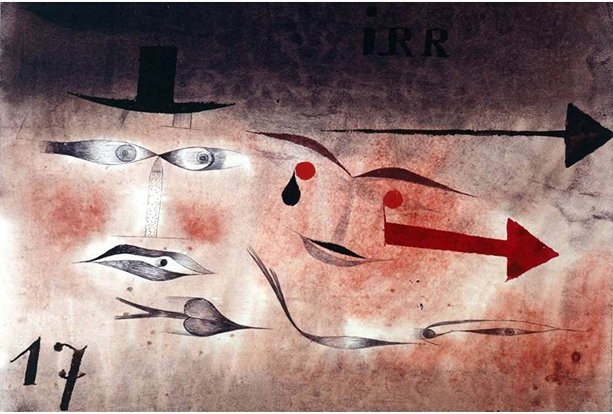

## 基本信息

- 作者：[[克利 Paul Klee]]
- 创作年代：1923
- 材质：纸面水彩与墨水 (*not from wiki*)
- 现存地：(*not from wiki*)

## 画面与技法

[[克利 Paul Klee]] 1923 年作。本讲与 [[走向衰老的人头 Head of a Man Going Senile]] 并列，作为他"运用直觉再造婴儿眼中的世界"的代表样本。画面以阿拉伯数字 "17" 为母题，体现克利**把画画当作"领着线条散步"**的实验性方法。

## 历史背景

(*not from wiki*) [[包豪斯 Bauhaus]] 任教时期的作品；克利此阶段反复试验以儿童涂画式的笔触承载理性结构。

## 图片清单

| 编号 | 出自 | 描述 |
|---|---|---|
| 01 | [[085｜克利：他为什么模仿小孩子画画？]] | 以"17"为母题的童稚构成 |

## 出现在

- [[085｜克利：他为什么模仿小孩子画画？]]
