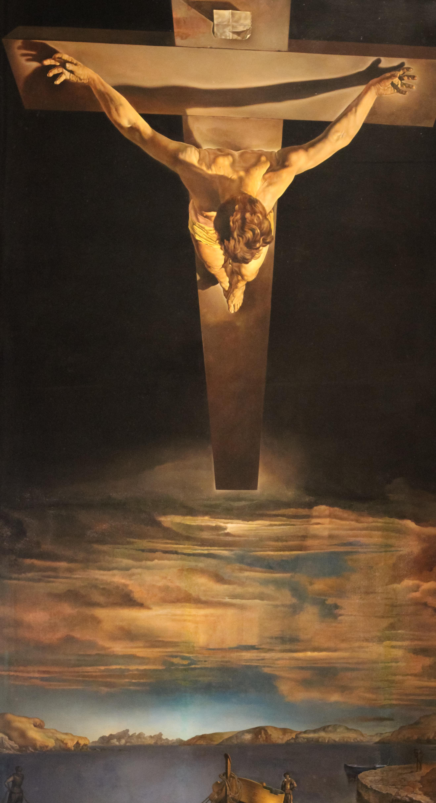

## 基本信息

- 作者：[[达利 Salvador Dalí]]
- 创作年代：1951
- 材质：布面油画 (*not from wiki*)
- 尺寸：(*not from wiki*) 205 × 116 cm
- 现存地：(*not from wiki*) 格拉斯哥凯尔文格罗夫艺术馆与博物馆（Kelvingrove Art Gallery and Museum, Glasgow）

## 画面与技法

094 中与《[[耶稣圣心 (达利) The Sacred Heart of Jesus]]》并列，作为达利**晚年皈依天主教**之后宗教画的代表作。

(*not from wiki*) 题名来源于 16 世纪西班牙加尔默罗会神秘主义诗人圣十字若望（San Juan de la Cruz）的一幅小素描——达利把这个**俯视构图**放大成壮观的画面：基督被钉于十字架，**从极高的天顶视角**俯瞰下方的加利利海与渔船（背景实景是 [[达利 Salvador Dalí]] 家乡 Cap de Creus 的渔港 Port Lligat）。**没有钉痕、没有荆冠、没有血迹**——纯几何性的神圣降临构图。

## 历史背景 (*not from wiki*)

1951 年由凯尔文格罗夫博物馆以 8200 英镑购入，当时引发苏格兰艺术界激烈争论（"花太多钱买达利"）。1961 年遭破坏后修复。如今是该馆的镇馆之宝。

## 图片清单

| 编号 | 出自 | 描述 |
|---|---|---|
| 01 | [[094｜达利：为什么他画的是"伪装的梦"？]] | 全图——俯视视角十字架 |

## 出现在

- [[094｜达利：为什么他画的是"伪装的梦"？]]
