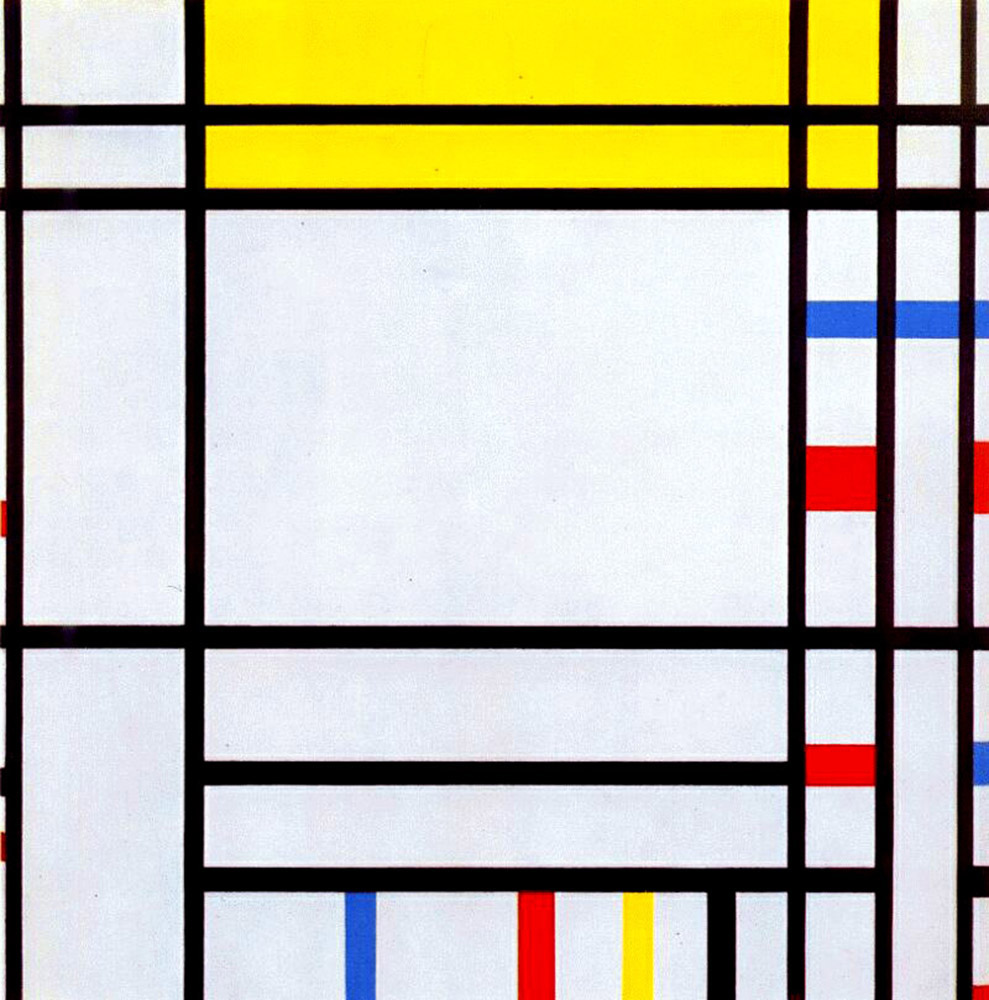

## 基本信息

- 作者：[[蒙德里安 Piet Mondrian]]
- 创作年代：1938–1943（蒙德里安竟然画了六年）
- 材质：(*not from wiki*：布面油画)
- 尺寸：(*not from wiki*：约 94 × 95 cm)
- 现存地：(*not from wiki*：达拉斯艺术博物馆)

## 画面与技法

依旧是黑色横竖直线把画布分割成长方格，少数格子填入红、黄、蓝色块。属于蒙德里安"通灵"工作流的代表案例：他穿着白大褂"跟科学家搞实验一样"，在画的过程中不断调整黑线条粗细位置、色块大小排列，等待"保险柜咔嗒一声打开"的心动时刻——所以同一构图竟可以反复打磨六年之久。

## 历史背景 (*not from wiki*)

题目暗示巴黎"协和广场"——但作品本身是纯抽象格子，与广场的真实形象毫无视觉对应关系。这本身就是 [[新造型主义 Neo-Plasticism]] 的态度：物象只是出发点的隐喻，最终必须被符号化为不再"指代"任何具体事物的横竖线条。

## 图片清单

| 编号 | 出自 | 描述 |
|---|---|---|
| 01 | [[084｜蒙德里安：他为什么要画那么多格子？]] | 协和广场（1938–1943） |

## 出现在

- [[084｜蒙德里安：他为什么要画那么多格子？]]
