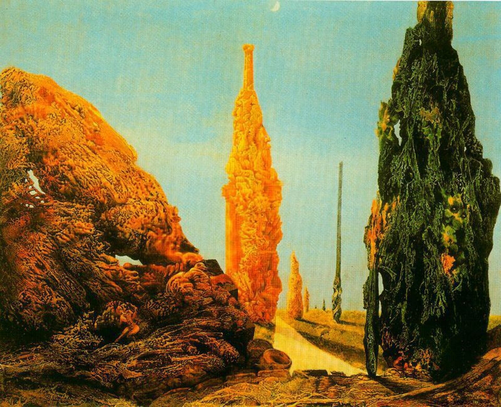

## 基本信息

- 作者：[[恩斯特 Max Ernst]]
- 创作年代：1940
- 材质：布面油画（[[拓印法 Decalcomania]]）(*not from wiki*)
- 现存地：马德里提森-博内米萨美术馆 Museo Thyssen-Bornemisza, Madrid (*not from wiki*)

## 画面与技法

[[拓印法 Decalcomania]] 代表作之一。拓印法生成的青苔/沼泽肌理被恩斯特就势塑造成孤独的与并立的树形——本课作为拓印法的三个典型样本之一（与《[[玛莲 (恩斯特) Marlene]]》《[[新娘的婚纱 (恩斯特) Attirement of the Bride]]》并列）。

## 图片清单

| 编号 | 出自 | 描述 |
|---|---|---|
| 01 | [[093｜契里柯与恩斯特：如何用绘画表现超现实主义？]] | 暗调地平线前一棵孤独的高树（左）与并立的两棵树（右），树身由拓印法的有机肌理构成 |

## 出现在

- [[093｜契里柯与恩斯特：如何用绘画表现超现实主义？]] — [[拓印法 Decalcomania]] 代表作
