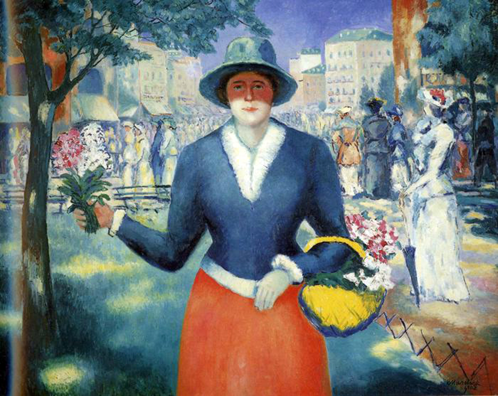

## 基本信息

- 作者：[[马列维奇 Kazimir Malevich]]
- 创作年代：1903
- 材质：布面油画 (*not from wiki*)
- 尺寸：年代不详 (*not from wiki*)
- 现存地：俄罗斯圣彼得堡国立俄罗斯博物馆 (*not from wiki*)

## 画面与技法

[[马列维奇 Kazimir Malevich]] 1903 年的早期作品，与 [[林荫大道 (马列维奇) On the Boulevard]] 同期。已经摆脱 [[施希金 Ivan Shishkin]] 的现实主义，融入了 [[印象派 Impressionism]] 的色彩与笔触。

## 历史背景

顾衡 083 将本作与《林荫大道》并列，作为马列维奇"全盘西化时期"印象派阶段的代表。

## 图片清单

| 编号 | 出自 | 描述 |
|---|---|---|
| 01 | [[083｜马列维奇：什么是至上主义？]] | 全画 |

## 出现在

- [[083｜马列维奇：什么是至上主义？]]
