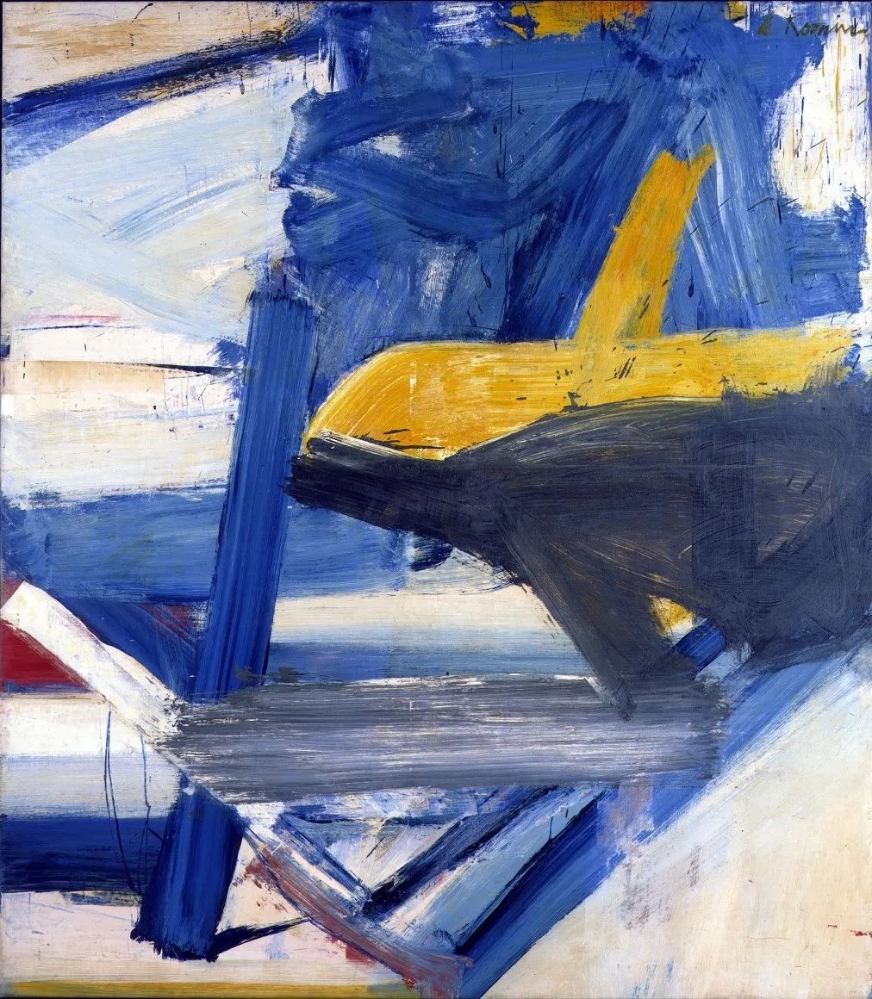

## 基本信息

- 作者：[[德·库宁 Willem de Kooning]]
- 创作年代：1957
- 材质：布面油画 (*not from wiki*)
- 现存地：私人收藏 (*not from wiki*)

## 画面与技法

德·库宁后期 **抽象风景** 阶段的作品，标题取自纽约州 Adirondacks 的小镇 Bolton Landing (*not from wiki*)。延续行动绘画的笔触语言，但母题从女性转向 **风景**——保留画笔与画架的刮抹涂层路径。本讲（097）作为德·库宁抽象表现主义代表作之一出现。

## 图片清单

| 编号 | 出自 | 描述 |
|---|---|---|
| 01 | [[097｜德·库宁：抽象表现主义追求什么？]] | 抽象风景，大块色彩交织，笔触饱含张力 |

## 出现在

- [[097｜德·库宁：抽象表现主义追求什么？]] — 抽象表现主义后期代表
