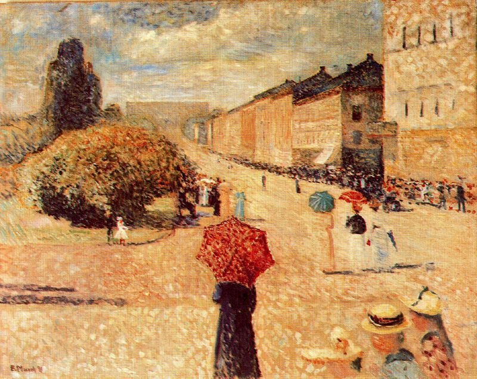

## 基本信息

- 作者：[[爱德华·蒙克 Edvard Munch]]
- 创作年代：1890
- 材质：布面油画 (*not from wiki*)
- 尺寸：未注明
- 现存地：卑尔根 KODE 美术馆 (*not from wiki*)

## 画面与技法

蒙克 1889 年得到奖学金赴 [[巴黎]] 游学后，**刚到巴黎对什么都新鲜**，尝试过 [[印象派 Impressionism]] 和 [[新印象主义 Neo-Impressionism]] 绘画——本作即此一阶段产物（顾衡 070）。

卡尔·约翰大街 (Karl Johans gate) 是奥斯陆中央大道——蒙克借法国式光感与笔触描绘本国街景，是其象征主义大转向前的过渡期标本。

## 历史背景 (*not from wiki*)

蒙克在巴黎短暂浸染印象派后不久即被 [[象征主义 Symbolism]] 致命邂逅吸引——[[夏凡纳 Pierre Puvis de Chavannes]] 的简化、[[莫罗 Gustave Moreau]] 的神秘、[[雷东 Odilon Redon]] 的怪诞、[[高更 Paul Gauguin]] 的用色专断——决定性影响发生于此（顾衡 070）。

## 图片清单

| 编号 | 出自 | 描述 |
|---|---|---|
| 01 | [[070｜蒙克1：表现主义的先行者经历了什么？]] | 印象派笔触下的奥斯陆主街 |

## 出现在

- [[070｜蒙克1：表现主义的先行者经历了什么？]]
