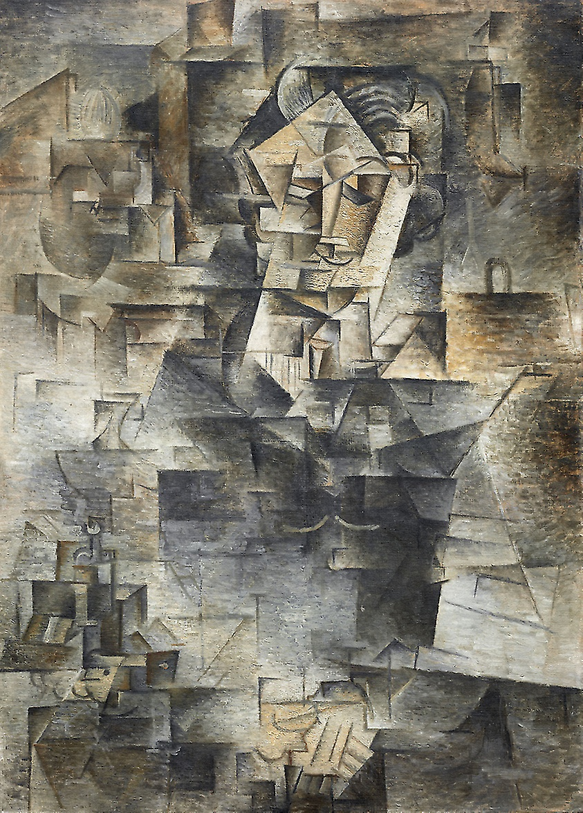

## 基本信息

- 作者：[[毕加索 Pablo Picasso]]
- 创作年代：1910
- 材质：布面油画 (*not from wiki*)
- 尺寸：100.4 × 72.4 cm (*not from wiki*)
- 现存地：芝加哥艺术博物馆 (Art Institute of Chicago) (*not from wiki*)

## 画面与技法

毕加索 [[立体主义 Cubism]] 分析阶段（Analytic Cubism）的代表性肖像之一——画中人卡恩韦勒（Daniel-Henry Kahnweiler, 1884-1979）是当时毕加索与 [[勃拉克 Georges Braque]] 的核心画商。整个画面被棕灰、土黄、银灰的色阶切碎为多角度同时呈现的几何小面 (facets)，传统五官与衣饰几乎完全溶解在结构网格里。 (*not from wiki*)

本讲（064）只把它作为 **与 [[戴帽子的女人 Woman with a Hat]] (1905, [[马蒂斯 Henri Matisse]]) 的对比起点** 引入——两位画家都声称受 [[塞尚 Paul Cézanne]] 影响，但代表作天差地别，需借 [[时代之眼 Period Eye]] 还原其成长环境才能解释。

## 历史背景 (*not from wiki*)

- 卡恩韦勒是德裔法籍画商，1907 年在巴黎开设 Galerie Kahnweiler，签约毕加索与勃拉克，是 [[立体主义 Cubism]] 全程最重要的市场推手。
- 1910 年正是分析立体主义的成熟年份，毕加索此年还画了费尔南德、Wilhelm Uhde、Vollard 等几幅同构肖像。

## 图片清单

| 编号 | 出自 | 描述 |
|---|---|---|
| 01 | [[064｜毕加索1：如何理解"蓝色时期"和"玫瑰红时期"？]] | 整幅画面（作为与马蒂斯《戴帽子的女人》的对比） |

## 出现在

- [[064｜毕加索1：如何理解"蓝色时期"和"玫瑰红时期"？]]
