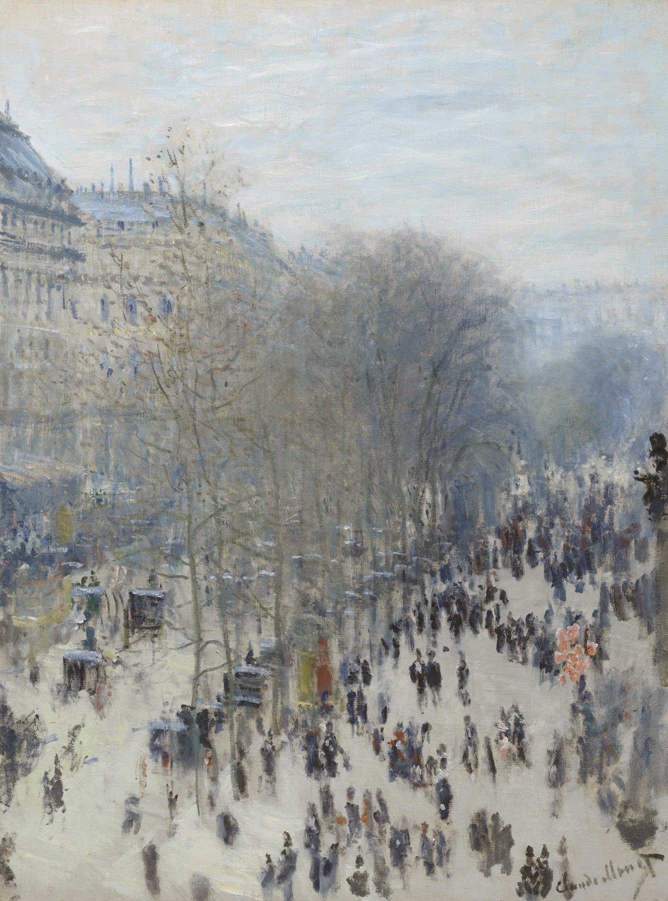

## 基本信息

- 作者：[[莫奈 Claude Monet]]
- 创作年代：1873—1874
- 材质：布面油画 (*not from wiki*)
- 尺寸：80 × 60 cm (*not from wiki*)
- 现存地：纳尔逊-阿特金斯艺术博物馆 Nelson-Atkins Museum of Art, Kansas City (*not from wiki*)

## 画面与技法

莫奈从纳达尔工作室阳台上俯瞰卡普辛大道的街景——朦朦胧胧的失焦人流，是莫奈早期"模糊化、印象化"画法的代表，043 顾衡借此与雷诺阿《[[蛙塘 La Grenouillère]]》(1869) 类比，说明两人同步追求的失焦视觉效果。

## 历史背景 (*not from wiki*)

1874 年在摄影家纳达尔 (Nadar) 的工作室参加**第一届印象派画展**——正是这次画展上路易·勒罗瓦在《喧噪》杂志撰文嘲讽莫奈的《日出·印象》，意外为整个画派命名。本作的拍摄地点（纳达尔工作室阳台）与画展会场重合，是印象派诞生地图上的核心地标。

## 图片清单

| 编号 | 出自 | 描述 |
|---|---|---|
| 01 | [[043｜雷诺阿：妥协如何造就大师？]] | 全图，俯瞰大道朦胧人群 |

## 出现在

- [[043｜雷诺阿：妥协如何造就大师？]]
