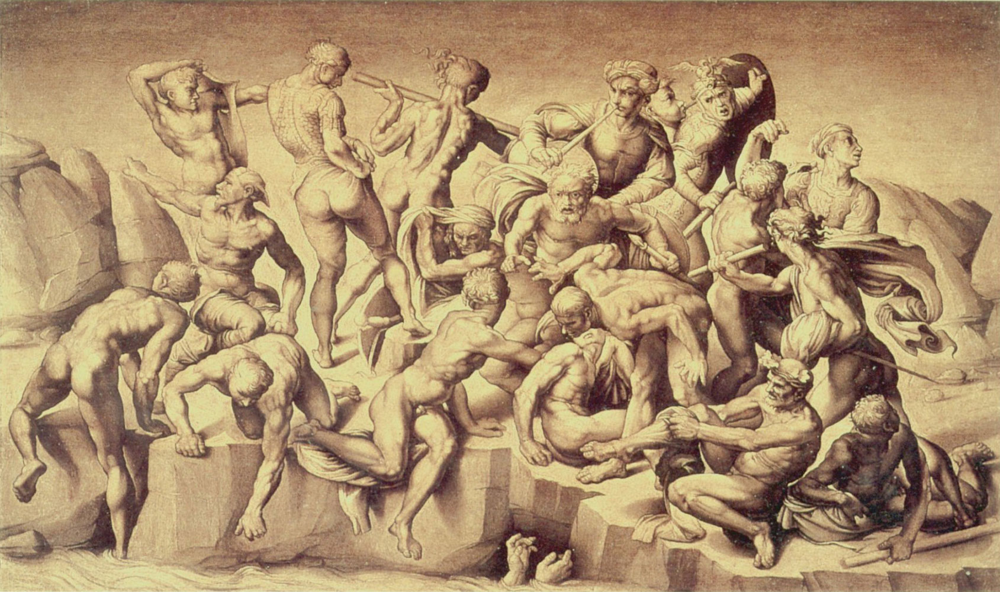

## 基本信息

- 作者：[[米开朗基罗 Michelangelo]]
- 创作年代：1504 (仅完成大型草图 cartoon；壁画未画) (*not from wiki*)
- 材质：原计划壁画；仅存大型素描草图，后被切碎散失
- 尺寸：原计划巨幅
- 现存地：**草图已佚**；今存 Aristotile (Bastiano) da Sangallo 1542 年的摹本 (Holkham Hall, Norfolk, UK) 与多份个别人物素描

## 画面与技法

题材：**1364 年佛罗伦萨与比萨的卡西纳之战**——佛罗伦萨方获胜。米开朗基罗的**巧妙构思**是不画战斗本身，而是画**战斗之前的瞬间**：**佛罗伦萨士兵正在阿尔诺河里洗澡**，听到敌人来袭的号角，**迅速从河水里爬出来、抓住衣甲与武器的瞬间**。

形式特征：

- **20+ 个全裸或半裸男体**，各种姿势的扭转——爬出河、弯腰穿衣、扭头看号角声方向——构成**男性裸体动作的全方位炫技**
- 这正是 [[米开朗基罗 Michelangelo]] 的核心兴趣：**人体作为雕塑般的造型对象**
- 在 1505 年完工的大型草图被全佛罗伦萨年轻画家**疯狂临摹**——是文艺复兴盛期"男性裸体绘画范本"的源头之一 (*not from wiki*)

## 历史背景

(*not from wiki*) 1504 与 [[达·芬奇 Leonardo da Vinci]] 同时为佛罗伦萨市政府打擂台 (见 [[安吉里战役 The Battle of Anghiari]])。米开朗基罗完成大型草图后被尤利乌斯二世召往罗马，壁画未实际画上墙。**大型草图后被切碎散失** (年轻画家争抢临摹时撕碎；瓦萨里也承认这点)。

后世评价：通过 Sangallo 摹本 + 多份单人素描复原的本作，被视为**米开朗基罗成熟期人体表现的全方位宣言**。后来的 [[西斯廷天顶画 Sistine Chapel Ceiling]] 上的男性裸体 (Ignudi) 直接延续此处的实验。

## 图片清单

| 编号 | 出自 | 描述 |
|---|---|---|
| 01 | [[013｜恩怨：文艺复兴三杰如何相互影响？]] | 摹本 (Sangallo 1542) |

## 出现在

- [[013｜恩怨：文艺复兴三杰如何相互影响？]]
