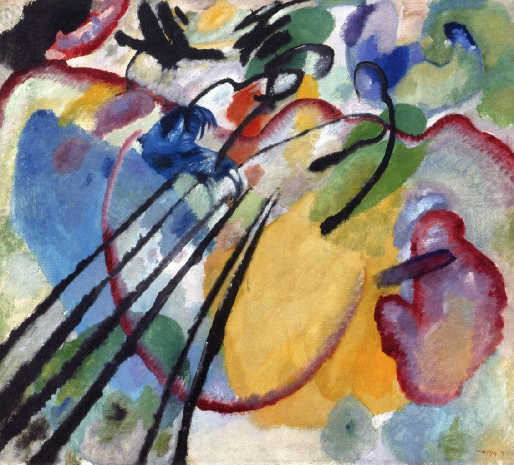

## 基本信息

- 作者：[[康定斯基 Wassily Kandinsky]]
- 创作年代：1912
- 材质：布面油画 (*not from wiki*)
- 尺寸：约 97 × 108 cm (*not from wiki*)
- 现存地：慕尼黑伦巴赫美术馆 (Lenbachhaus, Munich) (*not from wiki*)

## 画面与技法

顾衡 082 与《[[有白边的画 Painting with White Border]]》并列举证康定斯基**事后解释破坏抽象**的习惯——本画中"**从中心指向左下那几条黑线，画的是船桨**"（康定斯基本人明确表示）。

## 图片清单

| 编号 | 出自 | 描述 |
|---|---|---|
| 01 | [[082｜康定斯基2：他为什么走向抽象？]] | 黑线被释为"船桨"的"准抽象"作品 |

## 出现在

- [[082｜康定斯基2：他为什么走向抽象？]]
