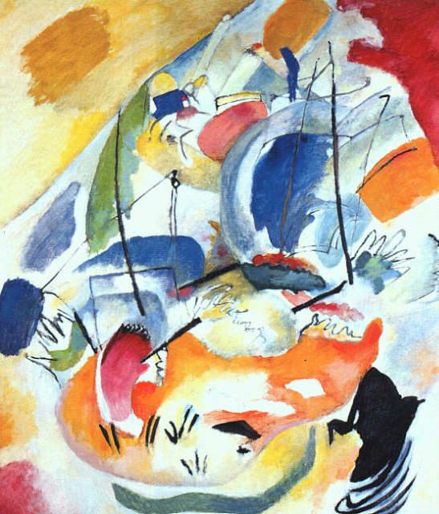

## 基本信息

- 作者：[[康定斯基 Wassily Kandinsky]]
- 创作年代：1913
- 材质：布面油画 (*not from wiki*)
- 尺寸：约 140 × 120 cm (*not from wiki*)
- 现存地：华盛顿国家美术馆 (National Gallery of Art, Washington) (*not from wiki*)

## 画面与技法

顾衡 082 与《[[梦的即席创作 Improvisation Dreamy]]》对照，说明从《[[穆尔瑙的教堂 Murnau with a Church]]》《[[抒情诗 Lyrical]]》（具象仍可辨）到 1913 年这两件**已明显抽象**的作品——可以**清晰看到康定斯基渐进抽象的过程**。

但顾衡也强调：**严格意义上**它们都还不算抽象画——因为康定斯基本人事后解释画面里有"船桨"等具体物象，破坏了"反具象"原则。

## 历史背景 (*not from wiki*)

1913 是康定斯基"即兴 / 构图"系列的高产年，与《[[构图七 Composition VII]]》《[[有白边的画 Painting with White Border]]》同年。副标题"海战"出自康定斯基自己的事后解释。

## 图片清单

| 编号 | 出自 | 描述 |
|---|---|---|
| 01 | [[082｜康定斯基2：他为什么走向抽象？]] | 渐进抽象的对照样本之一（1913） |

## 出现在

- [[082｜康定斯基2：他为什么走向抽象？]]
