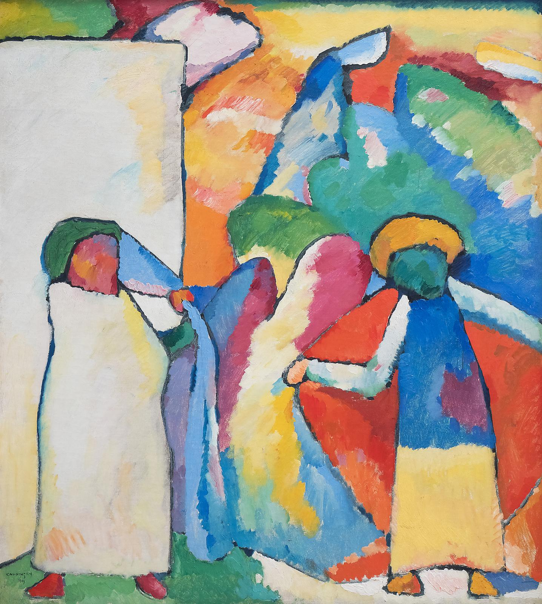

## 基本信息

- 作者：[[康定斯基 Wassily Kandinsky]]
- 创作年代：1909
- 材质：布面油画 (*not from wiki*)
- 尺寸：约 107 × 99 cm (*not from wiki*)
- 现存地：慕尼黑伦巴赫美术馆 (Lenbachhaus, Munich) (*not from wiki*)

## 画面与技法

顾衡 082 与《[[构图三 Composition III (Concert)]]》并列引用——说明康定斯基喜欢给画起《即兴6》《构图3》这样"**听着可抽象**"的名字，但实际**画面仍指向具象事物**（"非洲人"），所以"**他的抽象其实是有问题的**"。

## 图片清单

| 编号 | 出自 | 描述 |
|---|---|---|
| 01 | [[082｜康定斯基2：他为什么走向抽象？]] | 名"即兴"但仍指向"非洲人"具象 |

## 出现在

- [[082｜康定斯基2：他为什么走向抽象？]]
