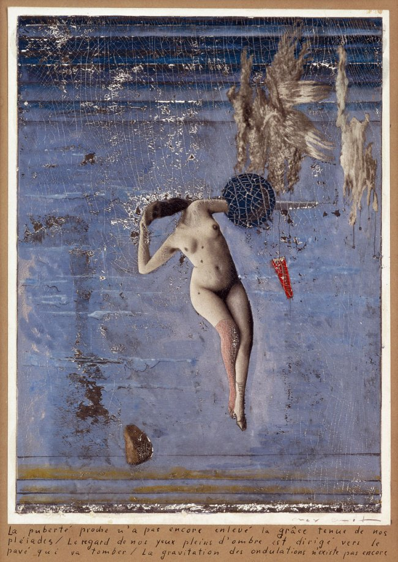

## 基本信息

- 作者：[[恩斯特 Max Ernst]]
- 创作年代：1921
- 材质：拼贴 / 综合材料 (*not from wiki*)
- 现存地：私人收藏 (*not from wiki*)

## 画面与技法

恩斯特巴黎期前夜（仍在德国时期）的代表作。本课把它列入"初到巴黎深受 [[艾吕雅 Paul Éluard]] 影响时期"的并列作品序列之中（虽然年代 1921 略早于 1922 巴黎正式定居），共同特征是：

- 画面各自独立的元素**毫无关联**
- 通过模仿"缝纫机、雨伞和解剖台"的错位搭配营造诗意
- 拒绝对单个元素做精神分析释义

## 图片清单

| 编号 | 出自 | 描述 |
|---|---|---|
| 01 | [[093｜契里柯与恩斯特：如何用绘画表现超现实主义？]] | 多个互不相关的物象在画面中错位组合：人形、机械、室外景观并置 |

## 出现在

- [[093｜契里柯与恩斯特：如何用绘画表现超现实主义？]] — 恩斯特巴黎前夜过渡期作品
