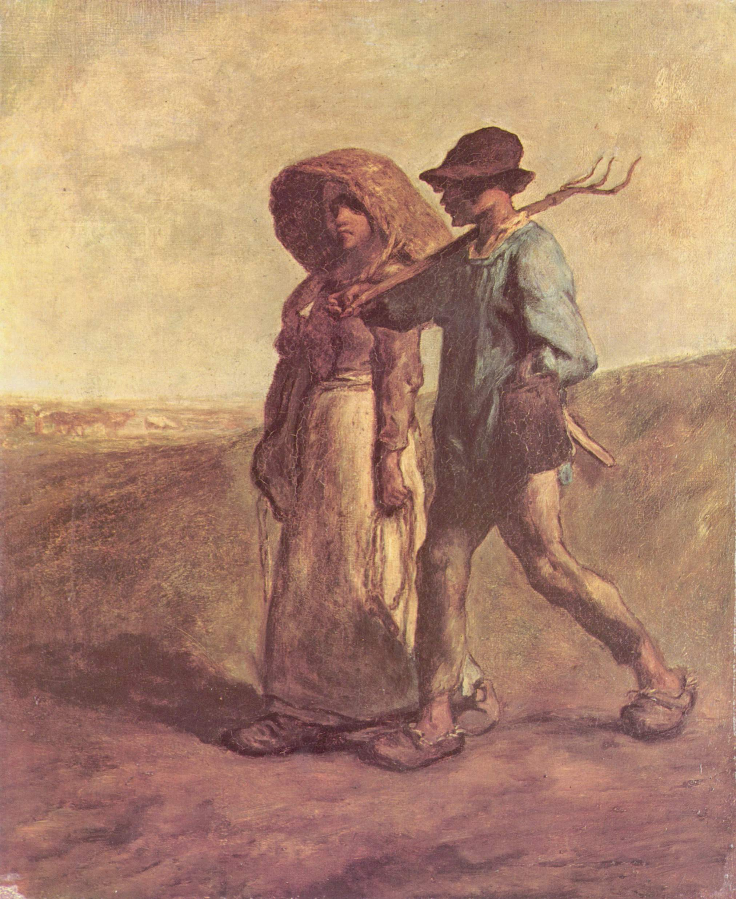

## 基本信息

- **作者**：[[米勒 Jean-François Millet]]
- **创作年代**：1851—1853
- **材质**：油画，布面 (*not from wiki*)
- **尺寸**：约 55 × 46 cm (*not from wiki*)
- **现存地**：英国格拉斯哥美术馆 / 美国辛辛那提美术馆（多版本）(*not from wiki*)

## 画面与技法

(*not from wiki*) 一对农夫农妇并肩走向田间——男执叉、女背筐——朝阳从画面右侧斜射。**两个身影**像在《晚钟》中一样并肩出现，但此处不是默祷的虔诚而是出工的劳作日常。米勒延续他的纪念碑式剪影手法。

## 历史背景 (*not from wiki*)

主题或受米开朗基罗 1504 年壁画《亚当和夏娃被逐出伊甸园》启发——把"劳作"作为人类原罪后的神圣命运。

## 在课程中的角色

顾衡 036 列入米勒**主题母题**组画——与《晚钟》《拾穗者》《播种者》《牧羊女》《扶锄男子》共同体现"诗意 + 对农民苦难的深切同情"的奏鸣曲主题。

## 图片清单

| 编号 | 出自 | 描述 |
|---|---|---|
| 01 | [[036｜米勒：什么是"伟大的现实主义"？]] | 全画 |

## 出现在

- [[036｜米勒：什么是"伟大的现实主义"？]] —— "米勒主题母题"组画之一
- [[米勒 Jean-François Millet]] —— 代表作
- [[现实主义 Realism]] —— 农民牧歌母题
