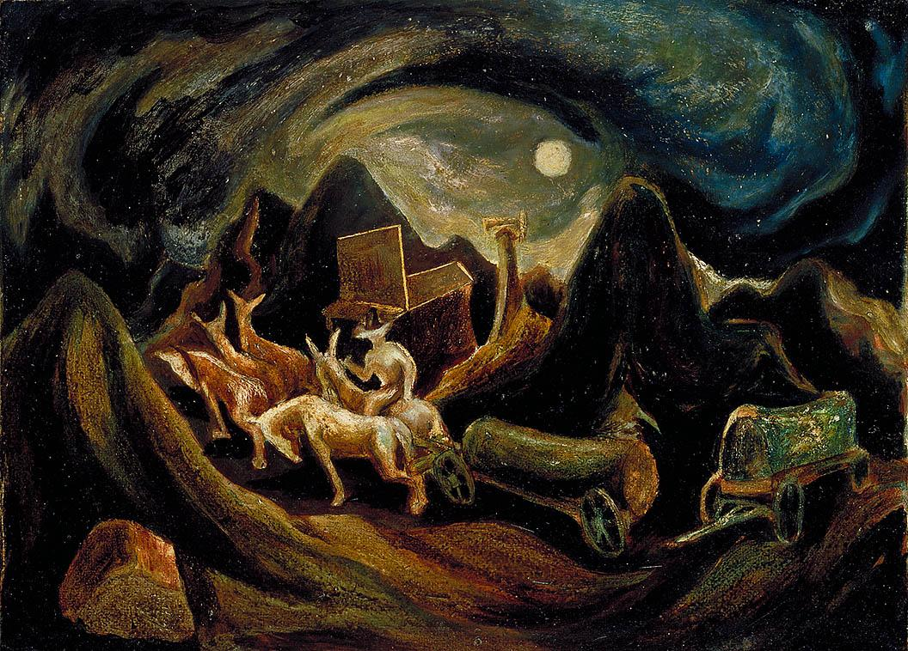

## 基本信息

- 作者：[[波洛克 Jackson Pollock]]
- 创作年代：1934
- 材质：(*not from wiki*)
- 尺寸：(*not from wiki*)
- 现存地：(*not from wiki*)

## 画面与技法

波洛克纽约时期早期作品，仍是具象路线，但已出现风格游移。顾衡说这一时期波洛克的画"像一大碗炒杂碎——野兽派、抽象派、立体主义、表现主义，什么都有点儿"。

## 历史背景 (*not from wiki*)

1934 年正值大萧条，波洛克 1935 年起靠 [[WPA]] 联邦艺术项目领工资。

## 图片清单

| 编号 | 出自 | 描述 |
|---|---|---|
| 01 | [[096｜波洛克：什么是当代艺术的第一个流派？]] | 去西方 Going West (1934) |

## 出现在

- [[096｜波洛克：什么是当代艺术的第一个流派？]]
