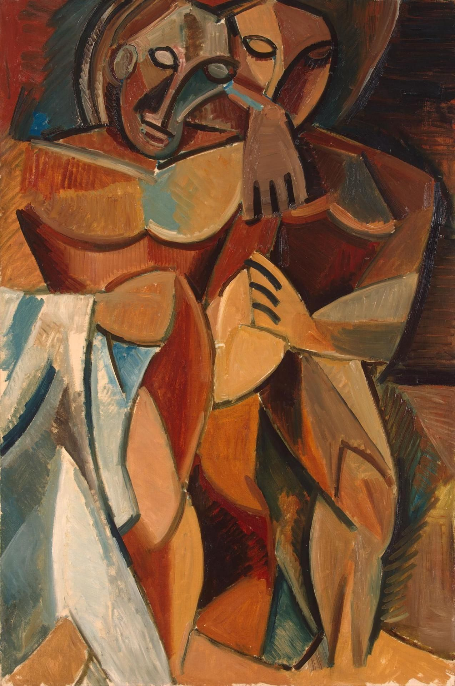

## 基本信息

- 作者：[[毕加索 Pablo Picasso]]
- 创作年代：1908
- 材质：油彩，画布 (*not from wiki*)
- 尺寸：(*not from wiki*) 约 152 × 101 cm
- 现存地：(*not from wiki*) 圣彼得堡冬宫博物馆 (State Hermitage Museum)

## 画面与技法

[[黑人时期 African Period (Picasso)|黑人时期]] 中期作品——按顾衡的解读，是毕加索在《[[亚威农少女 Les Demoiselles d'Avignon|亚威农少女]]》之后**找到自己方向**的样本：

> 仅仅按照字面意思去执行塞尚"大自然中的一切都要以球状、圆柱体和圆锥体去呈现"这句话，同时也对非洲原始艺术进行直接的挪用和抄袭。

两个女性身体被处理为面具化的脸 + 圆柱化的肢体 + 简化的体块，肤色采用赭色与土褐色的"非洲木雕"色调。

## 历史背景 (*not from wiki*)

冬宫这件作品是俄国收藏家 Sergei Shchukin 1908 年从 [[毕加索 Pablo Picasso]] 手中购入——Shchukin 是黑人时期最重要的买家之一，他和 Ivan Morozov 的收藏构成今天俄罗斯境内毕加索早期作品的主体。

## 图片清单

| 编号 | 出自 | 描述 |
|---|---|---|
| 01 | [[065｜毕加索2：如何理解"黑人时期"？]] | 全图——黑人时期中期"塞尚旗号 + 非洲木雕"的代表样本 |

## 出现在

- [[065｜毕加索2：如何理解"黑人时期"？]] —— [[黑人时期 African Period (Picasso)|黑人时期]] 中期代表作
